任务：

需验证的 [ceph软件源](https://build-repo.tarsier-infra.isrc.ac.cn/home:/laokz:/branches:/openEuler:/24.03/mainline_riscv64/riscv64/)

依托2403镜像验证修复后基本功能。参考链接：[a部分](https://gitee.com/samuel_yuan/play-with-openeuler-on-riscv-platform/blob/master/chapter1/Test-ceph-for-openeuler-on-qemu-part-a.md) 和 [b部分](https://gitee.com/samuel_yuan/play-with-openeuler-on-riscv-platform/blob/master/chapter1/Test-ceph-for-openeuler-on-qemu-part-b.md)

----

- 镜像： [openEuler RISC-V 24.03 版本](https://repo.tarsier-infra.isrc.ac.cn/openEuler-RISC-V/testing/2403LTS-test/v1/)  ， 使用 openEuler-24.03-V1-base-qemu-testing（文件如下图）

- kernal：6.6.0-14.0.0.10.oe2403.riscv64 

- Python：3.11.6

  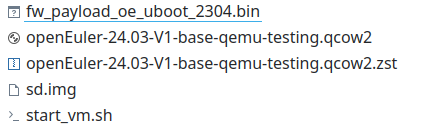

### part a

报错：第一次执行 `zsh start_vm.sh` 无法登录

```bash
Device 0: QEMU VirtIO Block Device
            Type: Hard Disk
            Capacity: 512.0 MB = 0.5 GB (1048576 x 512)
... is now current device
** No partition table - virtio 0 **
Couldn't find partition virtio 0:1
scanning bus for devices...

Device 0: unknown device
BOOTP broadcast 1
DHCP client bound to address 10.0.2.15 (5 ms)
Using virtio-net#3 device
TFTP from server 10.0.2.2; our IP address is 10.0.2.15
Filename 'boot.scr.uimg'.
Load address: 0x8c100000
Loading: *
TFTP error: 'Access violation' (2)
Not retrying...
BOOTP broadcast 1
DHCP client bound to address 10.0.2.15 (1 ms)
Using virtio-net#3 device
TFTP from server 10.0.2.2; our IP address is 10.0.2.15
Filename 'boot.scr.uimg'.
Load address: 0x84000000
Loading: *
TFTP error: 'Access violation' (2)
Not retrying...
```

解决：修改命令的安放顺序（成功）

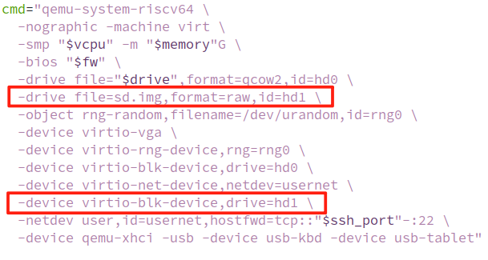

软件源路径 `/etc/yum.repos.d/openEuler.repo`

备份 `openEuler.repo` 后， 添加如下软件源

```
[laokz]
name=laokz
baseurl=https://build-repo.tarsier-infra.isrc.ac.cn/home:/laokz:/branches:/openEE
uler:/24.03/mainline_riscv64/riscv64/
enabled=1
gpgcheck=0
priority=99
```

使用 `dnf clean all && dnf makecache` 进行更新，发生报错

报错：无法下载 `repodata/repomd.xml`

```bash
[ceph@openeuler-riscv64 ~]$ dnf clean all && dnf makecache
//...
Errors during downloading metadata for repository 'laokz':
  - Status code: 404 for https://build-repo.tarsier-infra.isrc.ac.cn/home:/laokz:/branches:/openEuler:/24.03/mainline_riscv64/riscv64/repodata/repomd.xml (IP: 218.2.156.170)
Error: Failed to download metadata for repo 'laokz': Cannot download repomd.xml: Cannot download repodata/repomd.xml: All mirrors were tried
```

检查后发现 `/repodata/repomd.xml` 并不在 `https://build-repo.tarsier-infra.isrc.ac.cn/home:/laokz:/branches:/openEuler:/24.03/mainline_riscv64/riscv64/` 目录下， 而在 `https://build-repo.tarsier-infra.isrc.ac.cn/home:/laokz:/branches:/openEuler:/24.03/mainline_riscv64/` 目录下， 正确路径应该是issue所给目录的上一级目录

解决：修改 [laokz] 软件源路径（成功）

```bash
[laokz]
name=laokz
baseurl=https://build-repo.tarsier-infra.isrc.ac.cn/home:/laokz:/branches:/openEE
uler:/24.03/mainline_riscv64/
enabled=1
gpgcheck=0
priority=99
```

查看 ceph 存在软件包

```
[ceph@openeuler-riscv64 ~]$ dnf list ceph
Last metadata expiration check: 0:03:03 ago on Tue 30 Apr 2024 12:00:55 PM CST.
Available Packages
ceph.riscv64                       2:18.2.2-2.oe2403                       laokz
ceph.src                           2:18.2.2-2.oe2403                       laokz
```

查看 ceph 版本

```
[ceph@openeuler-riscv64 ~]$ ceph --version
ceph version 18.2.2 (531c0d11a1c5d39fbfe6aa8a521f023abf3bf3e2) reef (stable)
```

`sudo systemctl -l --no-page status ceph-mon@openeuler-riscv64` 查看 ceph-mon 运行状态， 启动成功

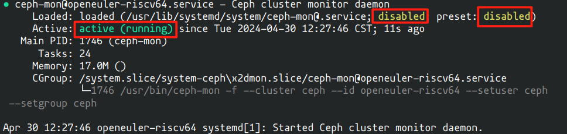

`ps axu|grep mon` 查看 mon 进程， 存在 ceph 进程

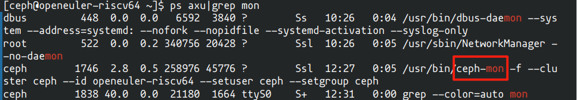

`ceph -s` 查看 ceph 状态， 存在报错但有反应

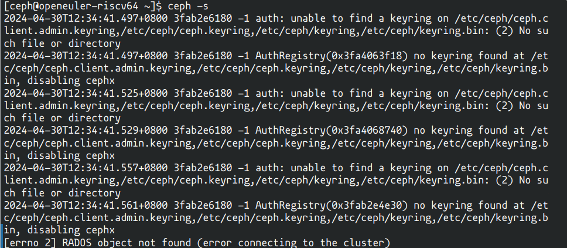

再次`sudo systemctl -l --no-page status ceph-mon@openeuler-riscv64` 查看 ceph-mon 运行状态， 不同的是 `loaded (/usr/lib/systemd/system/ceph-mon@.service`从 `disabled`变为`enabled`

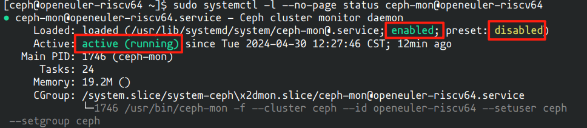 `vi /usr/lib/systemd/system/ceph-mon@.service`， 将MemoryDenyWriteExecute改成false

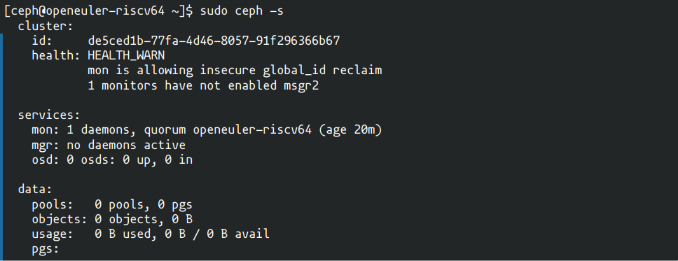

总结：

1. 在新建的 ceph 用户下执行，没有使用 root 用户，报错部分主要是由于配置不当或没有使用 sudo 权限，调整后均消失，其余显示结果与  [a部分](https://gitee.com/samuel_yuan/play-with-openeuler-on-riscv-platform/blob/master/chapter1/Test-ceph-for-openeuler-on-qemu-part-a.md) 一致， 说明 openeuler 的系统环境基本满足 ceph 的运行
2. 第一次使用`ps axu|grep mon` 查看 mon 进程， 即存在 ceph 进程启动，过了几分钟后，ceph 进程依然存在，运行正常

### part b

#### 测试ceph集群的osd

`sudo ceph-volume lvm create --data /dev/vdb`添加 osd 报错

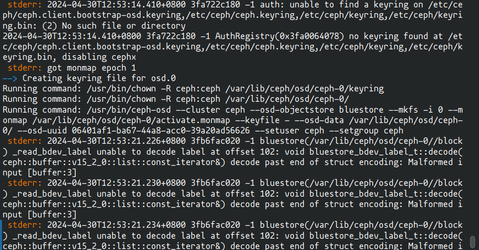

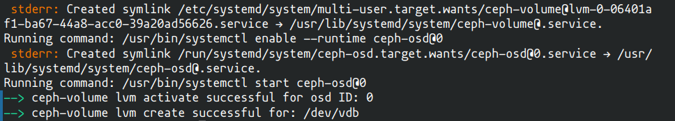

`sudo ceph -s`查看 ceph 集群状态，osd 启动成功。

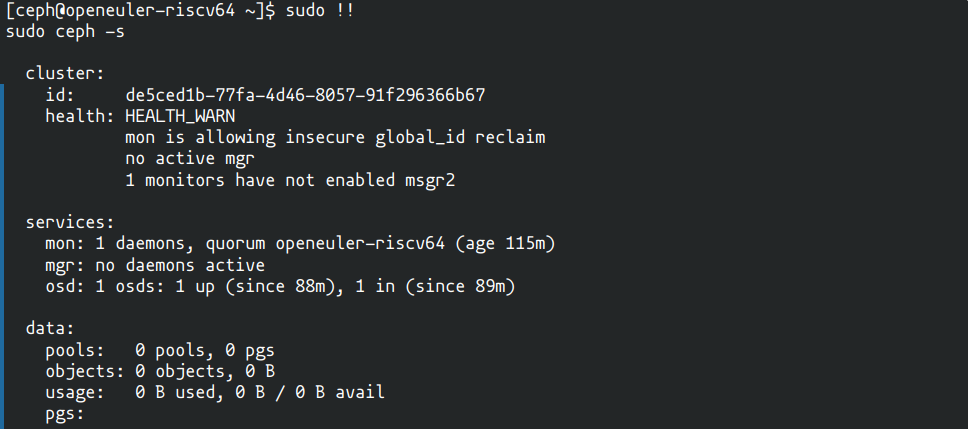

#### 测试ceph集群的mgr

`ceph mon enable-msgr2`启用 msgr2 后 `sudo ceph -s`再次查看 ceph 状态， `1 monitors have not enabled msgr2` 警告消失

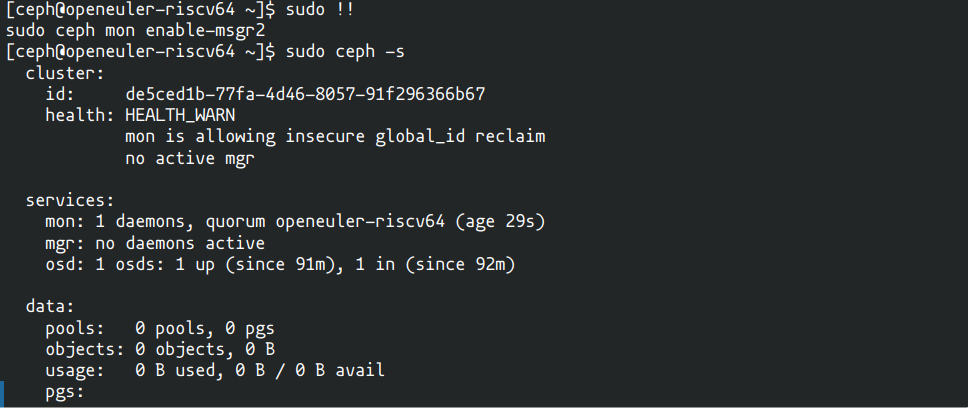

启动 ceph-mgr 并查看状态

```bash
sudo systemctl stop ceph-mgr@openeuler-riscv64
sudo systemctl start ceph-mgr@openeuler-riscv64
sudo systemctl enable ceph-mgr@openeuler-riscv64
sudo systemctl -l --no-page status ceph-mgr@openeuler-riscv64
```

出现如下信息

```
Apr 30 14:35:34 openeuler-riscv64 systemd[1]: Started Ceph cluster manager daemon.
Apr 30 14:35:39 openeuler-riscv64 ceph-mgr[4132]: /lib64/python3.11/site-packages/scipy/__init__.py:47: UserWarning: NumPy was imported from a Python sub-interpreter but NumPy does not properly support sub-interpreters. This will likely work for most users but might cause hard to track down issues or subtle bugs. A common user of the rare sub-interpreter feature is wsgi which also allows single-interpreter mode.
Apr 30 14:35:39 openeuler-riscv64 ceph-mgr[4132]: Improvements in the case of bugs are welcome, but is not on the NumPy roadmap, and full support may require significant effort to achieve.
Apr 30 14:35:39 openeuler-riscv64 ceph-mgr[4132]:   from numpy import __version__ as __numpy_version__
Apr 30 14:35:39 openeuler-riscv64 ceph-mgr[4132]: 2024-04-30T14:35:39.247+0800 3fbb85d020 -1 mgr[py] Module diskprediction_local has missing NOTIFY_TYPES member
Apr 30 14:35:52 openeuler-riscv64 ceph-mgr[4132]: 2024-04-30T14:35:52.951+0800 3fbb85d020 -1 mgr[py] Module nfs has missing NOTIFY_TYPES member
```

`sudo ceph -s`出现提示

```bash
Module 'restful' has failed dependency: PyO3 modules do not yet support subinterpreters, see https://github.com/PyO3/pyo3/issues/576
```

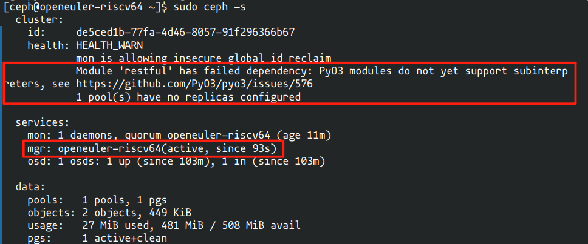

参考 [Solution for Module 'restful' has failed dependency: PyO3 modules](https://forum.proxmox.com/threads/solution-for-module-restful-has-failed-dependency-pyo3-modules.130369/) 

```bash
ceph mgr module disable dashboard
ceph mgr module disable restful
```
重新 `sudo ceph -s`，`Module 'restful' has failed dependency`报错消失， `1 pool(s) have no replicas configured` 依然存在


参考 [Ceph: 8 pool(s) have no replicas configured](https://blog.csdn.net/ichen820/article/details/125726554)

```bash
sudo ceph config set global mon_warn_on_pool_no_redundancy false
sudo systemctl restart ceph-mgr.target
```

再次 `sudo ceph -s`后报错消失，全部正常


#### 测试ceph集群的dashboard

`sudo ceph dashboard ac-user-create admin 123456 administrator`报错

```bash
Error EINVAL: Input file not specified: Please specify the file containing password/secret with "-i" option
```

参考 [创建dashboard用户时报错：Error EINVAL: Please specify the file containing the password/secret with "-i" option.](https://www.cnblogs.com/itsfei/p/17151768.html)

```bash
sudo echo "openEuler12#$"  > ~/password.txt\
sudo ceph dashboard ac-user-create admin -i ~/password.txt administrator
```

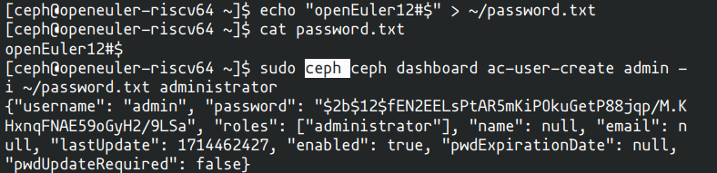

最后`sudo ceph -s`查看 ceph 集群状态， 依然正常

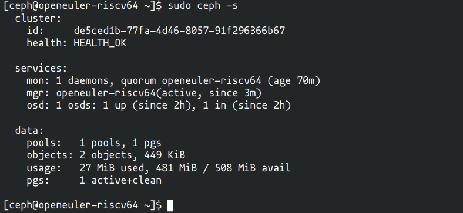

总结：

1.  openeuler的系统环境基本满足ceph的运行，osd、mgr、dashboard等均能正常运行。
2.   [b部分](https://gitee.com/samuel_yuan/play-with-openeuler-on-riscv-platform/blob/master/chapter1/Test-ceph-for-openeuler-on-qemu-part-b.md) 中关于python 3.10的bug没有出现
3.  密码需要先写在文件中，不能直接设置
4. 部分错误通过参考链接已获得解决，运行6小时无自动关闭现象
5. 未列举的操作或结果与参考链接一致
