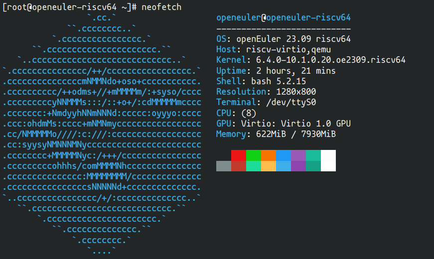
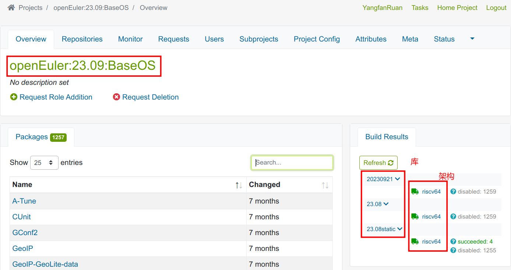
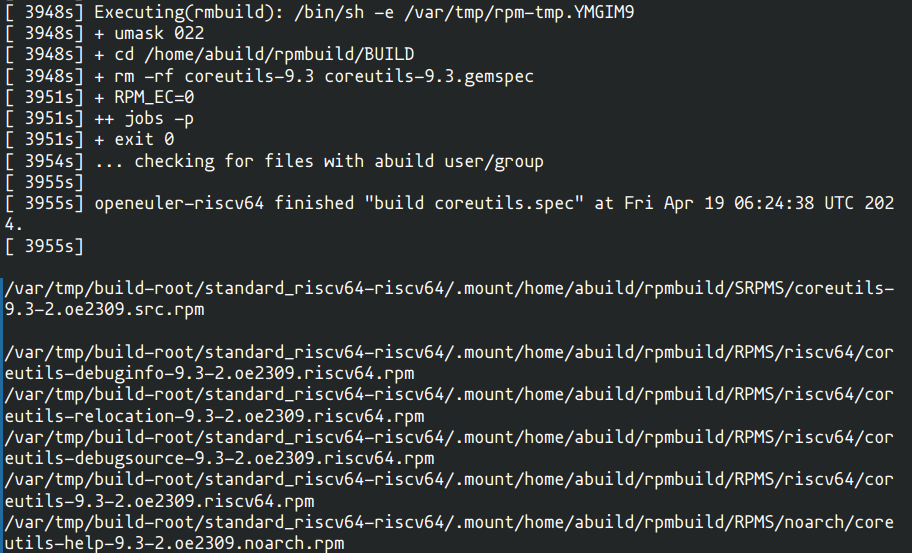
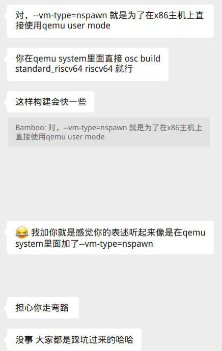
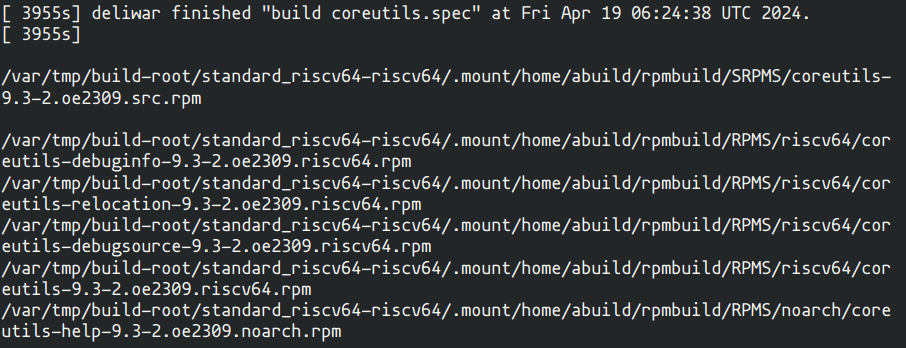

任务一：通过 QEMU 仿真 RISC-V 环境并启动 openEuler RISC-V 系统，设法输出 neofetch 结果并截图提交

任务二：在 openEuler RISC-V 系统上通过 obs 命令行工具 osc，从源代码构建 RISC-V 版本的 rpm 包，比如 pcre2。提示: 首先需要在 openEuler的 OBS上注册账号 https://build.openeuler.openatom.cn/project/show/openEuler:Mainline:RISC-V 

任务三：尝试使用 qemu user & nspawn 或者 docker 加速完成任务二 任务完成的方式为在本仓库提交 PR，并在 PR 的 Conversation 中附上任务完成截图，在Intern/intern_message.md 的 实习生信息 下中加入自己的信息（pretask 考核的一部分）。这个阶段希望实习生养成积极提问和正确提问的习惯，并且构建属于自己的工作流和环境。

------

说明： 任务一在 ubuntu22.04 实现，但任务二在本地构建的最后一步一直报错，折腾很长时间后选择更换电脑（arch linux系统）重新安装环境进行配置。主要记录在 Arch linux 下的走过的弯路。

## 任务一

### 下载openEuler RISC-V镜像

本电脑为Arch linux, 使用的是[openEuler-23.09-V1-riscv64]()， 下载文件并对压缩包进行解压缩后形成了分成了如下两个文件夹，openeuler_base 为无gui版本，openeuler_xfce 为有gui 版本，实际只要使用其中一个即可，我防止其中一个不好运行，因此两个都下载了。

```
openeuler_base
├── fw_payload_oe_uboot_2304.bin
├── openEuler-23.09-V1-base-qemu-preview.qcow2
├── openEuler-23.09-V1-base-qemu-preview.qcow2.zst
└── start_vm.sh

openeuler_xfce
├── fw_payload_oe_uboot_2304.bin
├── openEuler-23.09-V1-xfce-qemu-preview.qcow2
├── openEuler-23.09-V1-xfce-qemu-preview.qcow2.zst
└── start_vm_xfce.sh
```

### 通过 QEMU 仿真 RISC-V 环境

尝试1：仿照 ubuntu 安装 QEMU 的教程 [通过 QEMU 仿真 RISC-V 环境并启动 openEuler RISC-V 系统](https://www.openeuler.org/zh/blog/phoebe/2023-09-26-Run-openEuler-RISC-V-On-Qemu.html) 进行源代码的编译下载，企图在一些依赖包缺失时寻找其在 Arch 对应的依赖包名称进行下载， 但是缺失的包实在太多了，名称很难找对（放弃）

尝试2：在 Arch 官网寻找 qemu-system-riscv 相关的包，发现 [qemu-system-riscv 8.2.2-2](https://archlinux.org/packages/extra/x86_64/qemu-system-riscv/) ，遗憾的是 x86_*64 架构。没有 riscv*_64架构（放弃）

尝试3：从git下载安装，参考有 [oerv-pretask（一）@傻肥狍子](https://blog.csdn.net/weixin_52230326/article/details/135271629?spm=1001.2014.3001.5502) ，由于我的电脑之前没有任何配置，因此在启动openeuler镜像(见注1)的时候出现如下报错

报错` network backend 'user' is not compiled into this binary `

因此继续参照[qemu v7.2 network backend ‘user‘ is not compiled into this binary 问题](https://blog.csdn.net/qq502233945/article/details/128374465), 将安装编译qemu修改成如下(成功)

```
git clone https://github.com/qemu/qemu.git
cd qemu
./configure --enable-slirp
make -j$(nproc)
sudo make install
```

报错`qemu-system-riscv64: error while loading shared libraries: libslirp.so.0: cannot open shared object file: No such file or directory ``

尝试1：下载 [Libslirp-4.7.0](https://www.linuxfromscratch.org/blfs/view/svn/basicnet/libslirp.html) 并编译安装（无效）

```
meson build
ninja -C build install
```

尝试2： 继续添加libslirp路径（成功）

```
# 在整个文件系统中搜索名为 libslirp.so 或 libslirp.so.0（包括可能的版本号）的文件：
find / -name 'libslirp.so*' -type f 2>/dev/null
# 将 /usr/local/lib 添加到环境变量 LD_LIBRARY_PATH(临时->终端或永久->~/.zshrc)
export LD_LIBRARY_PATH=/usr/local/lib:$LD_LIBRARY_PATH
```

> 注1：启动openeuler镜像
>
> 安装完qemu后将 `/usr/local/bin/qemu-riscv64/bin` 添加至 `$PATH` 
>
> ```
> >sudo vim ~/.zshrc 如果是bash就 sudo vim ~/.zshrc
> export PATH="/usr/local/bin/qemu-riscv64/bin:\$PATH" # ~/.zshrc里添加后保存推出 
> source ~/.zshrc #生效
> ```
>
> 在 openeuler*xfce 路径下通过命令行输入*`zsh start_vm_xfce.sh`q即可启动， 密码以及其他配置参考 [通过 QEMU 仿真 RISC-V 环境并启动 openEuler RISC-V 系统](https://www.openeuler.org/zh/blog/phoebe/2023-09-26-Run-openEuler-RISC-V-On-Qemu.html)

### 输出 neofetch 结果

刚进入系统，我没有修改软件源，安装了make与git，整个过程都没有更换软件源

```
dnf install git make
```

在终端依次执行以下命令

```
git clone https://github.com/dylanaraps/neofetch.git
cd neofetch
sudo make install
```



输出成功

## 任务二

### 安装osc与build

尝试1：从github下载源代码编译安装，参考有 [oerv-pretask（一）@傻肥狍子](https://blog.csdn.net/weixin_52230326/article/details/135271629?spm=1001.2014.3001.5502) ，但是之后一直报错，因此卸载了（无效）

尝试2：使用包管理器进行直接安装（成功）

```
dnf install osc build
```

### 网页端注册与文件配置

由于有网址更新，尽可能保证正确，在以下两个网址都进行了相同用户名与密码的设置，在此感谢 [oerv-pretask（一）@傻肥狍子](https://blog.csdn.net/weixin_52230326/article/details/135271629?spm=1001.2014.3001.5502) 博主的好心提醒

> 网址1：https://build.openeuler.openatom.cn/
>
> 网址2：https://build.tarsier-infra.isrc.ac.cn/

版本一：

```
[general]
apiurl = https://build.openeuler.openatom.cn
no_verify=1
[https://build.openeuler.openatom.cn]
pass=xxxxxxxx
user=xxxxxxxx
```

版本二：

```
[general]
apiurl = https://build.tarsier-infra.com
no_verify=1
[https://build.tarsier-infra.com]
pass=xxxxxxxx
user=xxxxxxxx
```

版本三：

```
[general]
apiurl = https://build.tarsier-infra.isrc.ac.cn
no_verify=1
[https://build.tarsier-infra.isrc.ac.cn]
pass=xxxxxxxx
user=xxxxxxxx
```

在`～/.config/osc/oscrc`(路径或文件不存在时需要自己创建，账号与密码是在网址填入的内容)填入版本一或版本二或版本三

尝试1：填入版本一，在～目录下进行如下操作（成功）

```bash
osc co openEuler:23.09:RISC-V coreutils #这里不是唯一的，需要在网站对应查找确认
cd ./openEuler:23.09:RISC-V/coreutils
osc up -S
rm -f _service;for file in `ls`;do new_file=${file##*:};mv $file $new_file;done
osc repos  # 检查库名与架构名
osc build standard_riscv64 riscv64 # 这里不是唯一的，需要根据上一条指令的输出进行判断
```

`https://build.tarsier-infra.isrc.ac.cn`网站可以查看包的架构




>  注意：
>
>  1. 运行过程中发现普通用户与root用户的同一指令输出结果不一样
>
>  ```bash
>  # 普通用户
>  [openeuler@openeuler-riscv64 ~]$ osc co openEuler:23.09:RISC-V coreutils
>  File contains no section headers.
>  file: '/home/openeuler/.config/osc/oscrc', line: 6
>  'apiurl = https://build.tarsier-infra.com\n'
>  
>  # root用户
>  [root@openeuler-riscv64 openeuler]# osc co openEuler:23.09:RISC-V coreutils
>  A    openEuler:23.09:RISC-V
>  A    openEuler:23.09:RISC-V/coreutils
>  A    openEuler:23.09:RISC-V/coreutils/_service
>  At revision 7.
>  ```
>
>  因此我选择在root用户下操作，有问题也先在root下重新运行，在root下也需要在`～/.config/osc/oscrc`进行配置
>
>  2. 版本一在Arch下成功，在ubuntu上报错目前尚未找到原因
>
>     报错`TypeError: The following fields of 'KeyinfoPubkey' object are not initialized and have no default either: 'expires'`

最后的输出结果如下



为避免以后重蹈覆辙，在此也记录使用其他版本发生的错误

尝试2：使用版本二（无效）

报错：`urllib3.exceptions.HostChangedError: HTTPSConnectionPool(host='build.tarsier-infra.com', port=None): Tried to open a foreign host with url: https://build.tarsier-infra.isrc.ac.cn/source/openEuler%3A23.09%3ABaseOS/zlib/_meta`

尝试3：使用版本三（无效）

执行以下命令，可以拉取包

```bash
osc co openEuler:23.09:BaseOS zlib 
cd ./openEuler:23.09:BaseOS/zlib 
osc up -S
rm -f _service;for file in `ls`;do new_file=${file##*:};mv $file $new_file;done
osc repos  
osc build 23.08 riscv64 # 注意这里不再是stand_riscv64
```

但一千多秒的时候报错

```
[ 1428s] error: Installed (but unpackaged) file(s) found: 
[ 1428s]   /usr/lib/debug/usr/lib64/libminizip.so.1.0.0-1.2.13-2.oe2309.riscv64.debug 
[ 1428s]   /usr/lib/debug/usr/lib64/libz.so.1.2.13-1.2.13-2.oe2309.riscv64.debug 
[ 1428s]  
[ 1428s] RPM build warnings: 
[ 1428s]   line 31: It's not recommended to have unversioned Obsoletes: Obsoletes:     zib-static 
[ 1428s]  
[ 1428s] RPM build errors: 
[ 1428s]   Installed (but unpackaged) file(s) found: 
[ 1428s]   /usr/lib/debug/usr/lib64/libminizip.so.1.0.0-1.2.13-2.oe2309.riscv64.debug 
[ 1428s]   /usr/lib/debug/usr/lib64/libz.so.1.2.13-1.2.13-2.oe2309.riscv64.debug 
[ 1428s]  
[ 1428s] openeuler-riscv64 failed "build zlib.spec" at Thu Apr 18 04:18:10 UTC 2024. 
[ 1428s]  
The buildroot was: /var/tmp/build-root/23.08-riscv64\
```

## 任务三

这个任务由于我没有思考清楚，在oprv系统里对nspawn进行安装运行，一直报错

报错`[  26s] booting nspawn... ````[  26s] /usr/lib/build/build-vm-nspawn: line 34: systemd-nspawn: command not found ````[  26s] fgrep: warning: fgrep is obsolescent; using grep -F ````[  26s] /usr/lib/build/build-vm-nspawn: line 40: systemd-nspawn: command not found ````The buildroot was: /var/tmp/build-root/standard_riscv64-riscv64\`

尝试1：重启openeuler虚拟机再运行（无效）
尝试2：查询并添加systemd-nspawn路径（无效）

```bash
which systemd-nspawn
//...复制路径
vim ~/.zshrc
source ~/.zshrc
```


尝试3：检查nspawn是否启动

```
➜  qemu git:(master) sudo systemctl status systemd-binfmt.service
systemd-binfmt.service - Set Up Additional Binary Formats
     Loaded: loaded (/usr/lib/systemd/system/systemd-binfmt.service; static)
     Active: active (exited) since Thu 2024-04-18 15:09:03 CST; 3min 28s ago
       Docs: man:systemd-binfmt.service(8)
             man:binfmt.d(5)
             https://docs.kernel.org/admin-guide/binfmt-misc.html
             https://www.freedesktop.org/wiki/Software/systemd/APIFileSystems
    Process: 43363 ExecStart=/usr/lib/systemd/systemd-binfmt (code=exited, status=0/SUCCESS)
   Main PID: 43363 (code=exited, status=0/SUCCESS)
        CPU: 4ms
Apr 18 15:09:03 deliwar systemd[1]: Starting Set Up Additional Binary Formats...
Apr 18 15:09:03 deliwar systemd[1]: Finished Set Up Additional Binary Formats.
```

多亏得到了前辈大佬的指点，才幡然醒悟，任务三是需要在本机运行的!



reov小分队太温暖了呜呜呜

在本机上依次执行 [oerv-pretask（三）](https://blog.csdn.net/weixin_52230326/article/details/135319729?spm=1001.2014.3001.5502)，运行时报错

```
    [    2s]  failed "build coreutils.spec" at Thu Apr 18 12:21:07 UTC 2024.
    [    2s] 

    Build failed with exit code 1
    The buildroot was: /var/tmp/build-root/standard_riscv64-riscv64

    Cleaning the build root may fix the problem or allow you to start debugging from a well-defined state:
      - add '--clean' option to your 'osc build' command
      - run 'osc wipe [--vm-type=...]' prior running your 'osc build' command again
```

尝试1：osc build standard_riscv64 riscv64 --vm-type=nspawn --clean （无效） 

尝试2：osc wipe 后 osc build standard_riscv64 riscv64 --vm-type=nspawn（无效） 

尝试3：本机重启再运行 + 切换root（无效） 

尝试4：更换与虚拟机中不同的包进行拉取（无效） 

尝试6：卸载系统装的osc与osc-build, 从源码编译osc与osc-build再运行（无效）

因此最后只好退而求其次先使用chroot，结果如下，可以看出速度有一定程度上变快，但提高不多。



