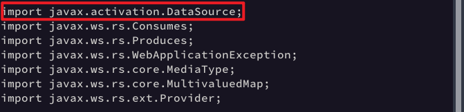

# 通用

> [报错：package javax.mail does not exist_javax.mail不存在](https://blog.csdn.net/guotong1988/article/details/127120463)
>
> [package javax.activation does not exist and mvn install not ...](https://stackoverflow.com/questions/61367969/java-mvn-package-javax-activation-does-not-exist-and-mvn-install-not-solving-it)
>
> [Java 项目编译的时候提示javax.xml.bind.annotation does ...](https://blog.csdn.net/huyuchengus/article/details/124673404)
>
> [Java工程找不到javax.xml.bind.annotation包原创](https://blog.csdn.net/scruffybear/article/details/134877513)
>
> [package javax.xml.bind.annotation does not exist error](https://stackoverflow.com/questions/68892633/package-javax-xml-bind-annotation-does-not-exist-error)
>
> [jboss-logmanager](https://gitee.com/src-openeuler/jboss-logmanager/blob/master/jboss-logmanager.spec#)
>
> [从JDK8升级到JDK11，看这篇就足够了 - 阿里云开发者社区](https://developer.aliyun.com/article/976911)
>
> https://gitee.com/src-openeuler/wildfly-core/commit/9efc5773604d6d6e09c9453a70f3626cdc9e7350
>
> https://www.mankier.com/7/pom_add_dep
>
> log中的软件源:https://repo.huaweicloud.com/repository/maven/
>
> 定立老师说的指导手册: https://docs.fedoraproject.org/en-US/java-packaging-howto/
>
> 黄:https://gitee.com/src-openeuler/apache-commons-math/pulls/12/files#null

```bash
%pom_add_dep groupId:artifactId[:version[:scope]] [POM-location]... [extra-XML]
%pom_add_dep org.jboss.spec.javax.annotation:jboss-annotations-api_1.2_spec:1.0.2.Final protocol
```


```bash
BuildRequires:       java-11-openjdk-devel
Requires:            java-11-openjdk

export JAVA_HOME=%{_jvmdir}/java-11-openjdk

* Sat Oct 12 2024 Yangfan Ruan <yangfan.oerv@isrc.iscas.ac.cn> - 1.1.10-3
- compile with openjdk11
```

# resteasy

```bash
less jaxrs/resteasy-jaxrs/src/main/java/org/jboss/resteasy/plugins/providers/DataSourceProvider.java
```




1. 代码解释
```bash
# `%`开头的部分是宏或指令，它们用于处理变量、配置编译和安装过程。
%global namedreltag .Final # 这行定义了一个全局变量`namedreltag`，值为`.Final`。它可以在文件的其他部分被引用，表示版本的后缀。
%global namedversion %{version}%{namedreltag} # 这是一个全局变量`namedversion`，它的值是由`%{version}`和`%{namedreltag}`拼接而成。这里的`%{version}`是另一个变量，表示当前的版本号，`%{namedreltag}`则是刚定义的`.Final`。所以`namedversion`变量将包含类似`3.0.19.Final`这样的版本标识。
Name:                resteasy


BuildArch:           noarch # 指定此包为`noarch`，意味着这个包不依赖特定的硬件架构，可以在任何架构上安装。
BuildRequires:       maven-local mvn(com.beust:jcommander) mvn(com.fasterxml:classmate) # 列出了在构建包时所需要的依赖项。这些依赖项是通过Maven构建工具管理的Java库。`mvn(...)`表示所需的Maven坐标，比如`mvn(io.netty:netty:3)`表示需要Netty 3.x版本的依赖。
BuildRequires:       mvn(com.fasterxml.jackson.core:jackson-annotations)


%description # 用于定义包的描述信息。它通常出现在每个包的描述部分，解释该包的功能和用途。在最终的 RPM 包生成后，这段描述将出现在 RPM 包的元数据中，供用户查看。
%global desc \ # 这一行定义了一个全局宏 `desc`，这个宏包含了一段文字描述。反斜杠 (`\`) 用于表示这段描述可以跨多行写。
RESTEasy contains a JBoss project that provides frameworks to help\
build RESTful Web Services and RESTful Java applications. It is a fully\
certified and portable implementation of the JAX-RS specification. # `RESTEasy` 是一个 JBoss 项目，提供了框架以帮助构建 RESTful Web 服务和 Java 应用程序，并且是 JAX-RS 规范的完全认证和可移植的实现。
%{desc} # 引用之前定义的宏 `desc`，等价于在该位置插入之前定义的那段完整的描述。这避免了重复编写相同的文字。
%global extdesc %{desc}\ # 这一行定义了另一个全局宏 `extdesc`，它直接引用了前面定义的 `desc` 宏的内容，并使用反斜杠表示可以跨多行书写。这一行的作用是创建一个与 `desc` 内容完全相同的宏 `extdesc`，这样在描述中可以通过引用 `extdesc` 来复用同样的描述。
\
This package contains # 这一行是包的实际描述的一部分，接下来的内容将描述该软件包的具体包含内容

# 这些 `package` 块是为了定义 `Resteasy` 项目在 RPM 包中的多个子包。每个子包对应特定的模块或功能组件，方便用户按需安装所需的部分，而不是整个项目
%package        javadoc # 这个子包用于提供 `Resteasy` 项目的 Javadoc 文档，也就是 API 文档。安装这个包后，用户可以查看 Resteasy 的详细 Java 类和方法文档。
Summary:             Javadoc for %{name}
%description    javadoc
This package contains the API documentation for %{name}.

%package        core # 包含 `Resteasy` 的核心模块，这是 RESTful Web 服务的基本实现部分。它是所有其他模块的基础。
Summary:             Core modules for %{name}
Obsoletes:           resteasy-jaxrs-api < 3.0.7
%description    core
%{extdesc} %{summary}. # 包含核心功能的简要描述

%package        atom-provider # 这是 `Resteasy` 用于处理 Atom 格式（主要用于Web feeds，例如 RSS feed）的模块。
Summary:             Module atom-provider for %{name}
%description    atom-provider
%{extdesc} %{summary}.

%package        jackson-provider # 这个模块为 `Resteasy` 提供 `Jackson` 支持，`Jackson` 是一个常用的 JSON 序列化和反序列化库。
Summary:             Module jackson-provider for %{name}
%description    jackson-provider
%{extdesc} %{summary}.

%package        jackson2-provider # 类似 `jackson-provider`，但支持 `Jackson 2.x` 版本。`Jackson 2` 是 `Jackson` 的更新版本，提供更强大的 JSON 处理功能。
Summary:             Module jackson2-provider for %{name}
%description    jackson2-provider
%{extdesc} %{summary}.


#这些包分为核心功能（`core`）、不同的数据格式支持（如 `atom-provider`、`json-p-provider` 等）、客户端支持（`client`）、测试支持（`test`）等模块化的组件，用户可以根据需要安装这些模块来扩展 `Resteasy` 的功能。


%prep # `%prep` 表示“准备”阶段。在这个阶段，会解压缩源代码并准备构建过程所需的依赖和配置。通常它是构建的第一步。
%setup -q -n Resteasy-%{namedversion} # `%setup` 是用于解压源代码的宏。 `-n Resteasy-%{namedversion}`：指定了解压后的目录名为 `Resteasy-%{namedversion}`，这里的 `%{namedversion}` 是前面定义的宏（例如 `3.0.19.Final`），因此解压后目录名可能是 `Resteasy-3.0.19.Final`。

# 这些命令使用了 Maven 打包相关的宏 `mvn_package`，用于指定要构建和安装的 Maven 包，以及它们的分组。
# **格式**：`%mvn_package "<Maven artifact ID>" <package name>`
# - `"<Maven artifact ID>"`：Maven 中每个依赖项的标识符（`artifactId`），它是 Maven 坐标的一部分。它用来指定哪个 Maven 项目或模块需要被打包。
# - `<package name>`：表示将此 Maven 包归类到哪个 RPM 子包。例如 `core`、`atom-provider`、`jackson-provider` 等。
# - `<package name>`：表示将此 Maven 包归类到哪个 RPM 子包。例如 `core`、`atom-provider`、`jackson-provider` 等。
# - **atom-provider**、**jackson-provider**、**jaxb-provider** 等表示不同的数据提供者模块，分别为 Atom、Jackson、JAXB 等提供支持。
# - **test** 包中的是用于测试功能的模块。
# - **optional** 是一些可选功能模块，如 `resteasy-cdi`、`resteasy-guice`，这些模块不是 `Resteasy` 的核心，但提供了额外的集成功能。
# - **netty3** 和 **netty4** 是 `Resteasy` 与不同版本的 Netty 框架集成的模块，用于网络通信支持。
# - **Maven打包宏**：`%mvn_package` 是一个 RPM 宏，专门用于处理基于 Maven 的 Java 项目打包，它会帮助将 Maven 的构建内容放入相应的 RPM 包中。
# - **模块化设计**：这一部分通过不同的子包（如 `core`、`atom-provider`、`optional` 等）将 `Resteasy` 的功能进行模块化，使得用户可以按需安装不同的功能模块。
%mvn_package ":resteasy-jaxrs" core  # 把 `resteasy-jaxrs` Maven 模块打包到 `core` 子包中。`resteasy-jaxrs` 是 Resteasy 的核心模块，用于实现 JAX-RS 规范。
%mvn_package ":providers-pom" core # 把 `providers-pom` 模块打包到 `core` 子包中。`providers-pom` 是 `Resteasy` 各种数据格式提供者（如 JSON、XML）模块的汇总。
%mvn_package ":resteasy-jaxrs-all" core # 把 `resteasy-jaxrs-all` 模块打包到 `core` 中，它可能包含了所有的 `jaxrs` 相关功能的打包集合。
%mvn_package ":resteasy-pom" core

%mvn_package ":resteasy-netty" netty3
find -name '*.jar' -print -delete

# 这部分包含多个 RPM spec 文件中的 Maven 宏，这些宏是专门用来修改基于 Maven 构建系统的项目配置的。在 RPM 包管理中，Maven 宏帮助处理依赖、禁用模块、应用补丁等操作。让我们逐个解释这些宏的含义：
%patch 0 # 这些宏用于应用补丁（patch）。在 RPM 构建过程中，`%patch` 会应用指定的补丁文件，以修改源代码。
%patch 5
%pom_disable_module resteasy-spring jaxrs # 用于禁用 Maven 构建中的某些模块。Maven 项目通常是模块化的，每个模块代表特定的功能或组件。通过这个宏，可以跳过不需要构建的模块。
%pom_disable_module fastinfoset jaxrs/providers

%pom_remove_plugin com.atlassian.maven.plugins:maven-clover2-plugin jaxrs # 从 Maven 项目中移除特定的插件。Maven 插件通常用于构建过程中执行特定任务（如测试覆盖率、报告生成等）。通过这个宏，可以移除不需要的插件，简化构建过程。
%pom_remove_plugin com.atlassian.maven.plugins:maven-clover2-plugin jaxrs/resteasy-jaxrs
%pom_change_dep "javax.servlet:servlet-api" "org.jboss.spec.javax.servlet:jboss-servlet-api_2.5_spec" jaxrs/tjws # 更改 Maven 项目中的依赖项。通过这个宏，可以替换项目的依赖项，指定替换后的依赖库。
%pom_xpath_set pom:properties/pom:dep.netty.version 3 jaxrs # 通过 XPath 表达式更改 Maven 项目中的 `pom.xml` 文件中的内容。它可以用来设置或修改特定的配置属性。
%pom_remove_dep -r javax.activation:activation jaxrs jaxrs/resteasy-jaxrs jaxrs/resteasy-test-data # 用于移除 Maven 项目中的某个依赖项。这个宏可以从指定的模块中删除不必要的依赖项。
%pom_remove_dep :tjws::test jaxrs/resteasy-jaxrs-testsuite

for f in ${files}; do
native2ascii -encoding UTF8 ${f} ${f} # 用于将指定的源代码文件从 UTF-8 编码转换为 ASCII 编码。它使用了 `native2ascii` 工具，该工具主要用于处理 Java 的国际化（i18n）资源，将包含非 ASCII 字符的文件转换为可在 ASCII 环境下使用的形式。
### 逐行解释
done
%pom_add_plugin org.apache.maven.plugins:maven-source-plugin jaxrs '
<configuration>
 <skipSource>true</skipSource>
</configuration>'

# 于在 Maven 项目（`pom.xml` 文件）中添加依赖项。`%pom_add_dep` 是 RPM 构建脚本中常见的一个宏，用于修改 Maven 项目文件（`pom.xml`），具体来说就是向 `pom.xml` 中加入依赖项（dependencies）。
# 它的格式通常是：`%pom_add_dep <groupId>:<artifactId>:<version> [<module>]`。
# - **`groupId`**：依赖的组织或项目标识。
# - **`artifactId`**：依赖的具体模块标识。
# - **`version`**：依赖的版本号。
# - **`module`**（可选）：指定依赖添加到哪个 Maven 模块中，通常用于多模块项目。
%pom_add_dep org.jboss.spec.javax.annotation:jboss-annotations-api_1.2_spec:1.0.2.Final protocol
%pom_add_dep org.jboss.spec.javax.annotation:jboss-annotations-api_1.2_spec:1.0.2.Final core-security/implementation
%pom_add_dep org.jboss.spec.javax.annotation:jboss-annotations-api_1.2_spec:1.0.2.Final version
%pom_add_dep org.jboss.spec.javax.annotation:jboss-annotations-api_1.2_spec:1.0.2.Final launcher

%build
export JAVA_HOME=%{_jvmdir}/java-11-openjdk # 通过设置 `JAVA_HOME` 环境变量来指定使用的 JDK 版本。
%mvn_build -f # 用于构建 Maven 项目。-f参数告诉 Maven 使用指定的 `pom.xml` 文件。这里的 `-f` 参数表示使用当前路径下的 `pom.xml` 文件进行构建。
find -name 'resteasy-*-%{namedversion}.jar' | while read f; do
  java -cp $(build-classpath jandex) org.jboss.jandex.Main -j ${f}
done

%install
%mvn_install # - 用于安装 Maven 构建结果的宏。
find -name "resteasy-*-jandex.jar" | while read f; do
  install -pm 644 ${f} %{buildroot}%{_javadir}/%{name}/$(basename -s "-%{namedversion}-jandex.jar" $f)-jandex.jar
done

# `%files` 用于指定哪些文件和目录应该包含在 RPM 包中。每个 `%files` 块可以定义不同的子包（比如 `core`, `atom-provider`, `jackson-provider` 等）。
# `%files` 块后面没有任何包名，意味着这是定义基础包（默认包）的文件列表。
%files
%doc README.md jaxrs/README.html # 该文件是文档文件，RPM 安装时会自动将这些文件标记为文档。通常它们会被安装到 `/usr/share/doc` 目录。
%license jaxrs/License.html # 用于指定许可证文件，类似于 `%doc`，但用于标记许可文件。通常这些文件会被安装到 `/usr/share/licenses` 目录中。
```
[package javax.xml.bind.annotation does not exist error [duplicate]](https://stackoverflow.com/questions/68892633/package-javax-xml-bind-annotation-does-not-exist-error)
# axiom

#### 1.8编译通过

#### 关键3句编译失败

```bash
2223
2024-10-17 19:56:38 [ERROR] /root/rpmbuild/BUILD/axiom-1.2.14/modules/axiom-testutils/src/main/java/org/apache/axiom/testutils/activation/RandomDataSource.java:[27,24] package javax.activation does not exist
2224
2024-10-17 19:56:38 [ERROR] /root/rpmbuild/BUILD/axiom-1.2.14/modules/axiom-testutils/src/main/java/org/apache/axiom/testutils/activation/RandomDataSource.java:[29,42] cannot find symbol
2225
2024-10-17 19:56:38 symbol: class DataSource
2226
2024-10-17 19:56:38 [ERROR] /root/rpmbuild/BUILD/axiom-1.2.14/modules/axiom-testutils/src/main/java/org/apache/axiom/testutils/activation/TestDataSource.java:[26,24] package javax.activation does not exist
2227
2024-10-17 19:56:38 [ERROR] /root/rpmbuild/BUILD/axiom-1.2.14/modules/axiom-testutils/src/main/java/org/apache/axiom/testutils/activation/TestDataSource.java:[32,40] cannot find symbol

2262
2024-10-17 19:56:38 [ERROR] Failed to execute goal org.apache.maven.plugins:maven-compiler-plugin:3.8.0:compile (default-compile) on project axiom-testutils: Compilation failure: Compilation failure:
2263
2024-10-17 19:56:38 [ERROR] /root/rpmbuild/BUILD/axiom-1.2.14/modules/axiom-testutils/src/main/java/org/apache/axiom/testutils/activation/RandomDataSource.java:[27,24] package javax.activation does not exist
2264
2024-10-17 19:56:38 [ERROR] /root/rpmbuild/BUILD/axiom-1.2.14/modules/axiom-testutils/src/main/java/org/apache/axiom/testutils/activation/RandomDataSource.java:[29,42] cannot find symbol
2265
2024-10-17 19:56:38 [ERROR] symbol: class DataSource
2266
2024-10-17 19:56:38 [ERROR] /root/rpmbuild/BUILD/axiom-1.2.14/modules/axiom-testutils/src/main/java/org/apache/axiom/testutils/activation/TestDataSource.java:[26,24] package javax.activation does not exist
2267
2024-10-17 19:56:38 [ERROR] /root/rpmbuild/BUILD/axiom-1.2.14/modules/axiom-testutils/src/main/java/org/apache/axiom/testutils/activation/TestDataSource.java:[32,40] cannot find symbol
2268
2024-10-17 19:56:38 [ERROR] symbol: class DataSource
2269
2024-10-17 19:56:38 [ERROR] -> [Help 1]
2270
2024-10-17 19:56:38 [ERROR]
2271
2024-10-17 19:56:38 [ERROR] To see the full stack trace of the errors, re-run Maven with the -e switch.
2272
2024-10-17 19:56:38 [ERROR] Re-run Maven using the -X switch to enable full debug logging.
2273
2024-10-17 19:56:38 [ERROR]
2274
2024-10-17 19:56:38 [ERROR] For more information about the errors and possible solutions, please read the following articles:
2275
2024-10-17 19:56:38 [ERROR] [Help 1] http://cwiki.apache.org/confluence/display/MAVEN/MojoFailureException
2276
2024-10-17 19:56:38 [ERROR]
2277
2024-10-17 19:56:38 [ERROR] After correcting the problems, you can resume the build with the command
2278
2024-10-17 19:56:38 [ERROR] mvn <args> -rf :axiom-testutils
2279
2024-10-17 19:56:38
2280
2024-10-17 19:56:38 RPM build warnings:
2281
2024-10-17 19:56:38
2282
2024-10-17 19:56:38 RPM build errors:
2283
2024-10-17 19:56:38 error: Bad exit status from /var/tmp/rpm-tmp.BzV4Wa (%build)
```

#### `%pom_add_dep com.sun.activation:javax.activation:1.2.0`添加无效

#### `BuildRequires: mvn(com.sun.activation:javax.activation)'添加报错

```bash
504
2024-10-17 20:48:34 No matching package to install: 'mvn(com.sun.activation:javax.activation)'
505
2024-10-17 20:48:34 Not all dependencies satisfied
```

#### `BuildRequires:       mvn(jakarta.activation:jakarta.activation-api)`通过

#### `%pom_add_dep com.sun.activation:javax.activation:1.2.0-r` 添加报错

```bash
error: /root/rpmbuild/SPECS/axiom.spec: line 43: Unknown option r in pom_add_dep()
```

``


```bash
2024-10-17 21:20:20 [ERROR] Failed to execute goal org.apache.maven.plugins:maven-compiler-plugin:3.8.0:compile (default-compile) on project axiom-testutils: Compilation failure: Compilation failure:
```

javax.activation
```
one.gfw/javax.activation-api@1.2.0
javax.activation/javax.activation-api@1.2.0
com.sun.activation/javax.activation@1.2.0

org.glassfish/javax.activation@10.0-b28
org.eclipse.jetty.orbit/javax.activation@1.1.0.v201105071233
org.apache.sling/org.apache.sling.javax.activation@0.3.0
javax.activation/activation@1.1.1
com.guicedee.services/javax.activation@1.2.2.1-jre17

org.kie.modules/javax-activation-api-main@6.5.0.Final
com.github.livesense/org.liveSense.fragment.javax.activation-jre-1.6@1.0.5
org.wso2.orbit.javax.activation/activation@1.1.1.wso2v4
com.jwebmp.thirdparty/javax.activation@0.68.0.1
eu.ocathain.javax.activation/activation@1.1.1
```

```bash
BuildRequires:       mvn(one.gfw:javax.activation-api)
BuildRequires:       mvn(javax.activation:javax.activation-api)
BuildRequires:       mvn(com.sun.activation:javax.activation)
BuildRequires:       mvn(org.glassfish:javax.activation)
BuildRequires:       mvn(org.eclipse.jetty.orbit:javax.activation)
BuildRequires:       mvn(org.apache.sling:org.apache.sling.javax.activation)
BuildRequires:       mvn(javax.activation:activation)
BuildRequires:       mvn(com.guicedee.services:javax.activation)
BuildRequires:       mvn(org.kie.modules:javax-activation-api-main)
BuildRequires:       mvn(com.github.livesense:org.liveSense.fragment.javax.activation-jre-1.6)
BuildRequires:       mvn(org.wso2.orbit.javax.activation:activation)
BuildRequires:       mvn(com.jwebmp.thirdparty:javax.activation)
BuildRequires:       mvn(eu.ocathain.javax.activation:activation)
```
```bash
%pom_add_dep one.gfw:javax.activation-api:1.2.0
%pom_add_dep javax.activation:javax.activation-api:1.2.0
%pom_add_dep com.sun.activation:javax.activation:1.2.0
%pom_add_dep org.glassfish:javax.activation:10.0-b28
%pom_add_dep org.eclipse.jetty.orbit:javax.activation:1.1.0.v201105071233
%pom_add_dep org.apache.sling:org.apache.sling.javax.activation:0.3.0
%pom_add_dep javax.activation:activation:1.1.1
%pom_add_dep com.guicedee.services:javax.activation:1.2.2.1-jre17
%pom_add_dep org.kie.modules:javax-activation-api-main:6.5.0.Final
%pom_add_dep com.github.livesense:org.liveSense.fragment.javax.activation-jre-1.6:1.0.5
%pom_add_dep org.wso2.orbit.javax.activation:activation:1.1.1.wso2v4
%pom_add_dep com.jwebmp.thirdparty:javax.activation:0.68.0.1
%pom_add_dep eu.ocathain.javax.activation:activation:1.1.1
```
