# #551 dnf

> https://github.com/openeuler-riscv/oerv-team/issues/551

查看失败用例

| 测试套 |               测试用例                |
| :----: | :-----------------------------------: |
|  dnf   |    oe_test_dnf_enabled_enablerepo     |
|  dnf   |    oe_test_dnf_provides_randomwait    |
|  dnf   | oe_test_dnf_repeat-upgrade-downgrade  |
|  dnf   | oe_test_service_dnf-automatic-install |

查看测试要求: 所有测试用例均不需要额外条件

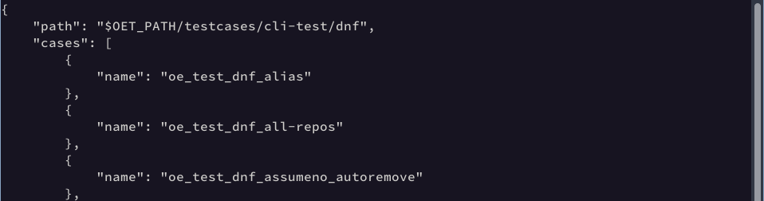

测试命令

```bash
bash mugen.sh -f dnf -r oe_test_dnf_enabled_enablerepo -x
bash mugen.sh -f dnf -r oe_test_dnf_provides_randomwait -x
bash mugen.sh -f dnf -r oe_test_dnf_repeat-upgrade-downgrade -x
bash mugen.sh -f dnf -r oe_test_service_dnf-automatic-install -x
```

### oe_test_service_dnf-automatic-install

r64下测试失败

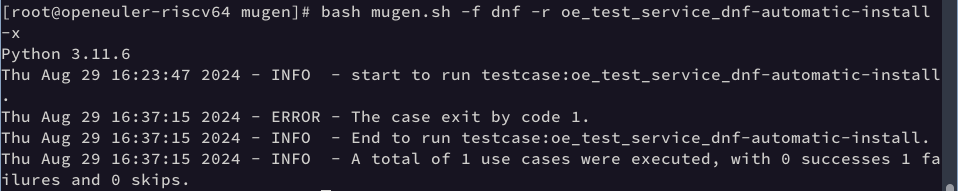

x86 下测试失败

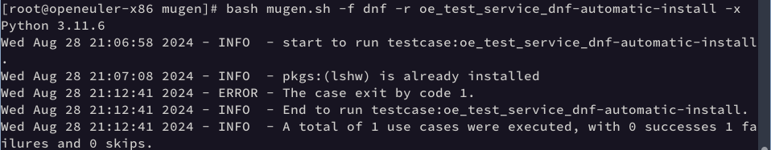

r64log信息

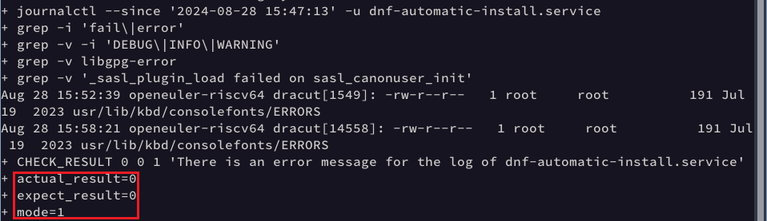

x86下log信息

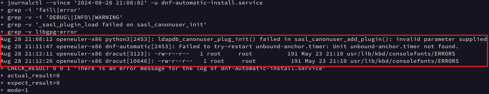

分析

可以看出r64 与x86都错在`    journalctl --since "${log_time}" -u "${service}" | grep -i "fail\|error" | grep -v -i "DEBUG\|INFO\|WARNING" | grep -v "libgpg-error" | grep -v "_sasl_plugin_load failed on sasl_canonuser_init"`这一句，这一句的的执行结果找到了符合条件的行。也就是说，日志中存在除 `DEBUG`、`INFO`、`WARNING`、`libgpg-error` 和 `_sasl_plugin_load failed on sasl_canonuser_init` 以外的错误或失败信息, 在x86下有`ldapdb_canonuser_plug_init() failed in sasl_canonuser_add_plugin()`、`Unit unbound-anchor.timer not found`、`usr/lib/kbd/consolefonts/ERRORS`，在r64下有`usr/lib/kbd/consolefonts/ERRORS`，只需要将过滤条件继续添加即可

```bash
journalctl --since "${log_time}" -u "${service}" | grep -i "fail\|error" | grep -v -i "DEBUG\|INFO\|WARNING" | grep -v "libgpg-error" | grep -v "_sasl_plugin_load failed on sasl_canonuser_init" | grep -v  "ldapdb_canonuser_plug_init() failed in sasl_canonuser_add_plugin()" |  grep -v  "Unit unbound-anchor.timer not found" |  grep -v  "usr/lib/kbd/consolefonts/ERRORS" 
```

修改后r64测试成功

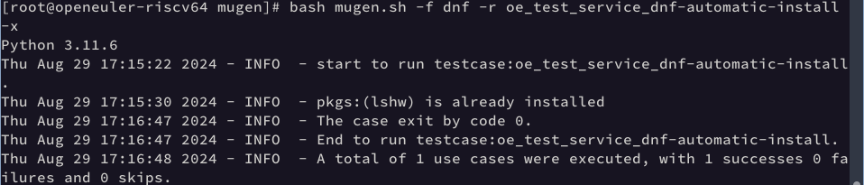

修改后x86测试成功

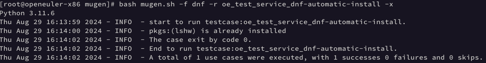

### oe_test_dnf_provides_randomwait

x64下测试通过

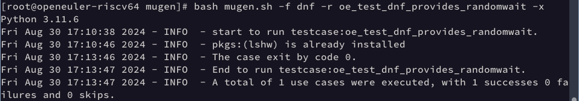

x86下测试通过

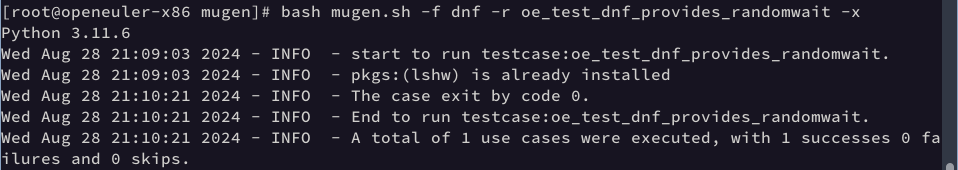

### oe_test_dnf_enabled_enablerepo

x86下通过

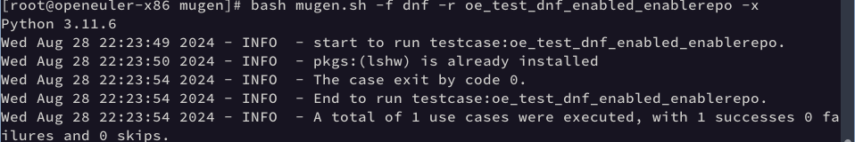

r64下失败

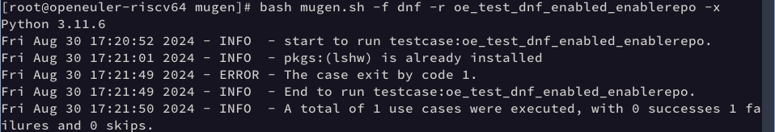

x64log信息

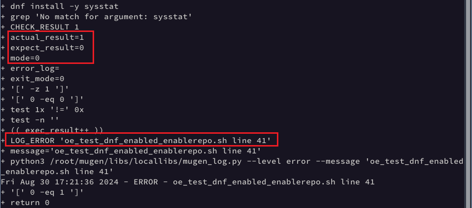

单步调试执行，使用`dnf config-manager --set-disable "OS" "everything"`后依然有如下可用仓库

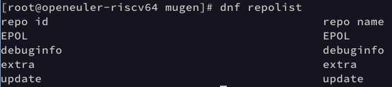

安装`sysstat`发现在`update`仓库中依然可以下载，如果禁用`update`仓库报错信息为`"There are no enabled repositories"`

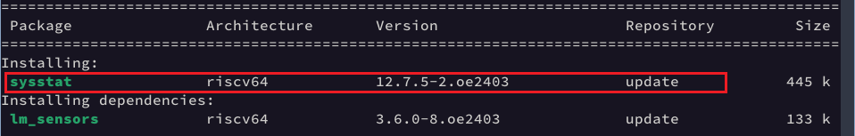

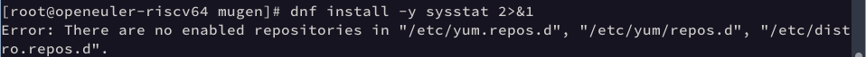

结合上下文推断下载`sysstat`的作用是测试仓库的禁用是否真的有效，早期可能仓库只有“OS”与“everything”，因此只禁用了这两个，现在仓库数目变多，应该禁用所有仓库进行测试。将代码修改为：

```bash
dnf config-manager --set-disable "*"
dnf install -y sysstat 2>&1 | grep "There are no enabled repositories"
```

修改后r64下测试通过

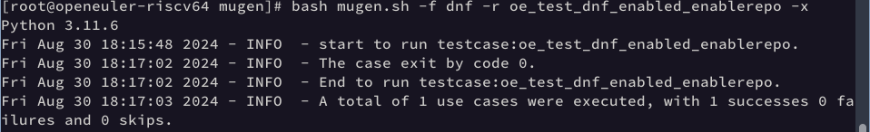

修改后x86下测试通过


### oe_test_dnf_repeat-upgrade-downgrade

r64下测试失败

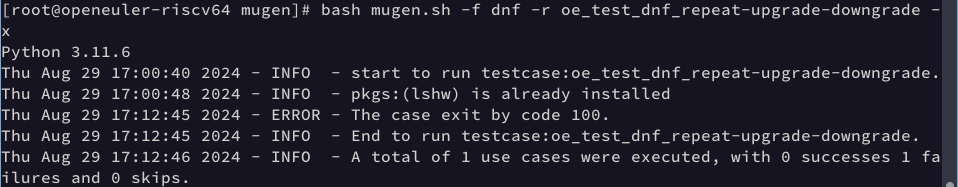

x86下测试失败

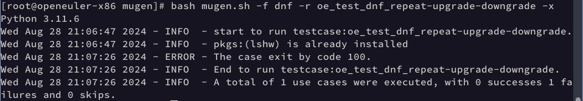

r64下与x86下log信息相同

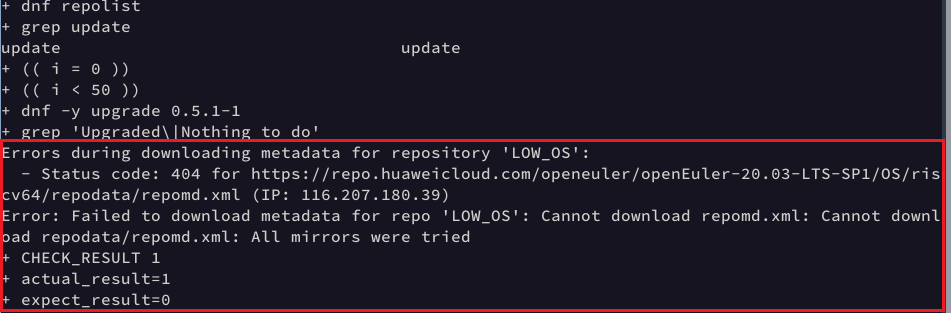

分析与尝试：

1. 换源添加架构信息

   由于报错显示无法下载仓库`LOW_OS`的源数据，找到`common.sh`文件下的仓库链接，发现只有`aarch64`与`x86_64`架构

   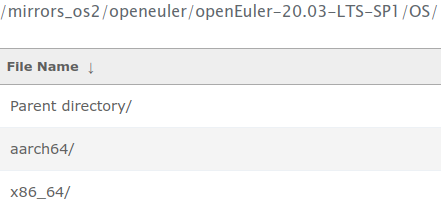

   仓库太老，没有`riscv64`架构，需要进行更换。华为云下最初支持riscv64架构的仓库为`openEuler-23.09`，于是将`LOW_OS`与`debuginfo`仓库设置为`openEuler-23.09`,`update`仓库设置为`openEuler-24.03-LTS`

   ```bash
   dnf list --installed | grep "@anaconda" | grep "arch\|x86_64\|riscv64" | awk '{print $1}' | awk -F. 'OFS="."{$NF="";print}' | awk '{print substr($0, 1, length($0)-1)}' >anaconda_list
   
   dnf list --available --repo=update | grep "arch\|x86_64\|riscv64" |xargs| awk '{print $1}' | awk -F . 'OFS="."{$NF="";print}' | awk '{print substr($0, 1, length($0)-1)}' >update_pkg_list
   ```

   ```bash
   function add_low_repo() {
       touch /etc/yum.repos.d/openEuler_update.repo
       dnf repolist|grep "^LOW_OS"
       result_value=$?
       if ((result_value !="0"));then
           echo "
   [LOW_OS]
   name=LOW_OS
   baseurl=https://repo.huaweicloud.com/openeuler/openEuler-23.09/OS/\$basearch/
   enabled=1
   gpgcheck=1
   gpgkey=https://repo.huaweicloud.com/openeuler/openEuler-23.09/OS/\$basearch/RPM-GPG-KEY-openEuler
   " >>/etc/yum.repos.d/openEuler_update.repo
       fi
   
       dnf repolist|grep "^update"
       result_value=$?
       if ((result_value !="0"));then
           echo "
   [update]
   name=update
   baseurl=https://repo.huaweicloud.com/openeuler/openEuler-24.03-LTS/update/\$basearch/
   enabled=1
   gpgcheck=1
   gpgkey=https://repo.huaweicloud.com/openeuler/openEuler-24.03-LTS/OS/\$basearch/RPM-GPG-KEY-openEuler
   " >>/etc/yum.repos.d/openEuler_update.repo
       fi
       dnf repolist|grep "^debuginfo"
       result_value=$?
       if ((result_value !="0"));then
           echo "
   [debuginfo]
   name=debuginfo
   baseurl=https://repo.huaweicloud.com/openeuler/openEuler-23.09/debuginfo/\$basearch/
   enabled=1
   gpgcheck=1
   gpgkey=https://repo.huaweicloud.com/openeuler/openEuler-23.09/debuginfo/\$basearch/RPM-GPG-KEY-openEuler
   " >>/etc/yum.repos.d/openEuler_update.repo
       fi
   }
   ```

   修改后降级操作出现两类错误

   类型1：预处理中有的包不可降级

   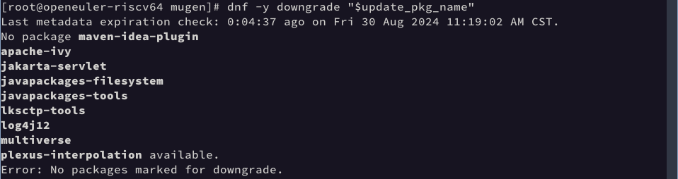

   类型2：从install_log中找不到从update仓库中安装的软件

   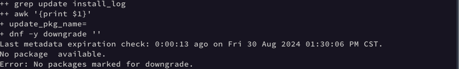

   根据以上两类错误得知，问题出在代码段：

   ```bash
   dnf install -y "$update_pkg_name" | tee install_log
   update_pkg_name=$(grep update install_log | awk '{print $1}')
   dnf -y downgrade "$update_pkg_name"
   ```

   结合上下文，这段代码的逻辑为：1.安装本机中没有的而在update仓库中有的可用包并记录日志; 2.从安装日志中提取从update仓库中具体安装的包名及其依赖; 3.对所有具体安装的包名及其依赖进行降级。

   出现类型1的错误是因为新安装的包存在部分包没有更低版本可供降级，出现类型2的错误是因为安装的包全部不来自update仓库，导致降级操作中包名变为空。

   因此，猜想提取从update仓库中具体安装的包名及其依赖进行降级是不合适的。最好直接对安装的包进行降级，这样系统能自动决定哪些包有更低版本可供降级，对不可降级的包保持原样，由于添加了`LOW_OS`，可以降级的软件包是能够被找到的。

2. 去除`update_pkg_name=$(grep update install_log | awk '{print $1}')`

   去除后x86下报错

   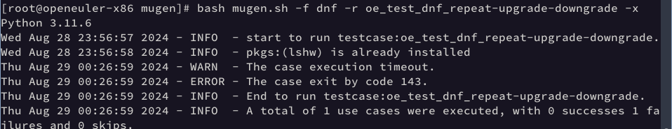

​	x86下报错信息

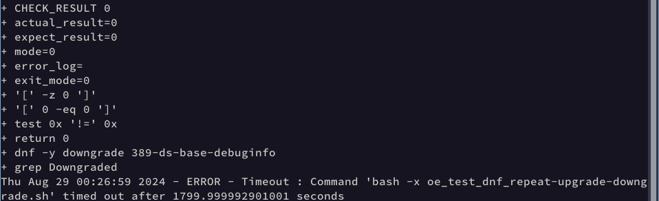

可见软件包的升级与降级都正常，但由于循环次数过大，30分钟后依然没有执行完毕，vi中使用`:%s/(( i++ ))//gn`进行统计,代码执行次数为33次，因此可以把循环次数变小一些，设置20

修改后x86下测试通过

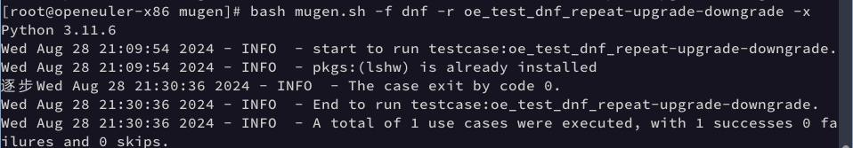

修改后r64下测试通过		

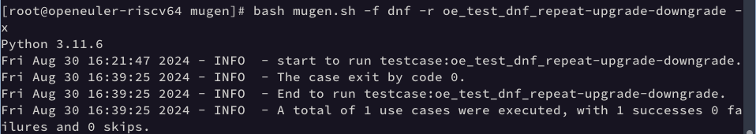

### 


---

---

# #726 fio

查看失败用例

| 测试套 |    测试用例     |
| :----: | :-------------: |
|  fio   | oe_test_fio_001 |
|  fio   | oe_test_fio_002 |
|  fio   | oe_test_fio_004 |

查看测试要求: 需要2个不小于2G的硬盘


```bash
# 创建磁盘
qemu-img create -f qcow2 disk1.qcow2 5G
qemu-img create -f qcow2 disk2.qcow2 5G
qemu-img create -f qcow2 disk3.qcow2 5G

# 启动脚本中添加磁盘信息
-drive file=disk1.qcow2,format=qcow2,id=hd1,if=none \
-device virtio-blk-pci,drive=hd1 \
-drive file=disk2.qcow2,format=qcow2,id=hd2,if=none \
-device virtio-blk-pci,drive=hd2 \
-drive file=disk3.qcow2,format=qcow2,id=hd3,if=none \
-device virtio-blk-pci,drive=hd3 \
```


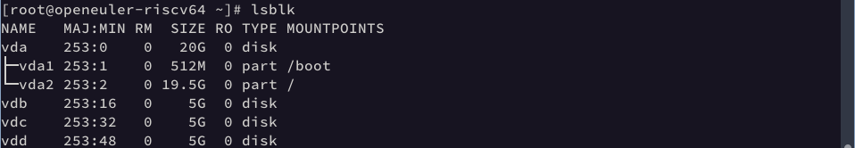

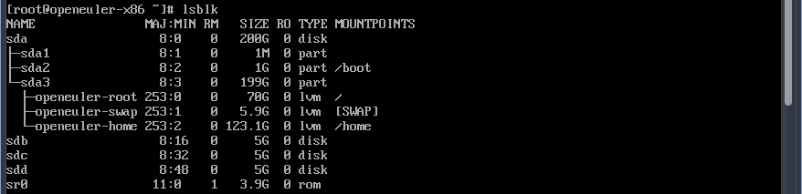

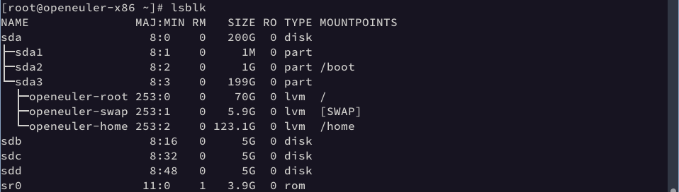

测试命令

```bash
bash mugen.sh -f fio -r oe_test_fio_001 -x
bash mugen.sh -f fio -r oe_test_fio_002 -x
bash mugen.sh -f fio -r oe_test_fio_004 -x
```


### oe_test_fio_001

x64下通过

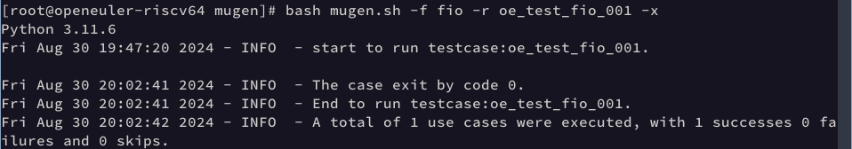

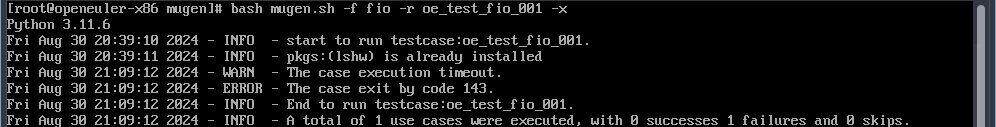

### oe_test_fio_002

fio下测试通过

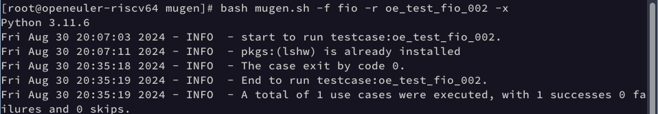

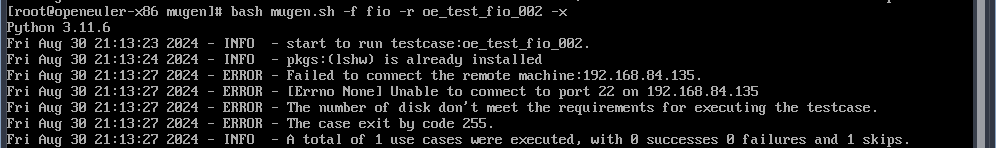

### oe_test_fio_004

r64下测试通过

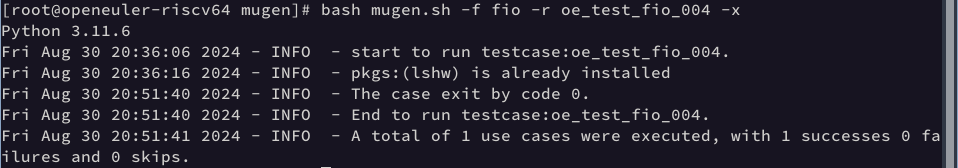

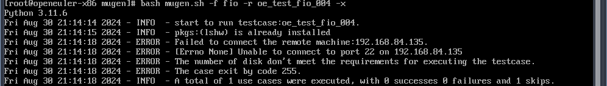
