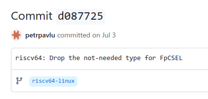
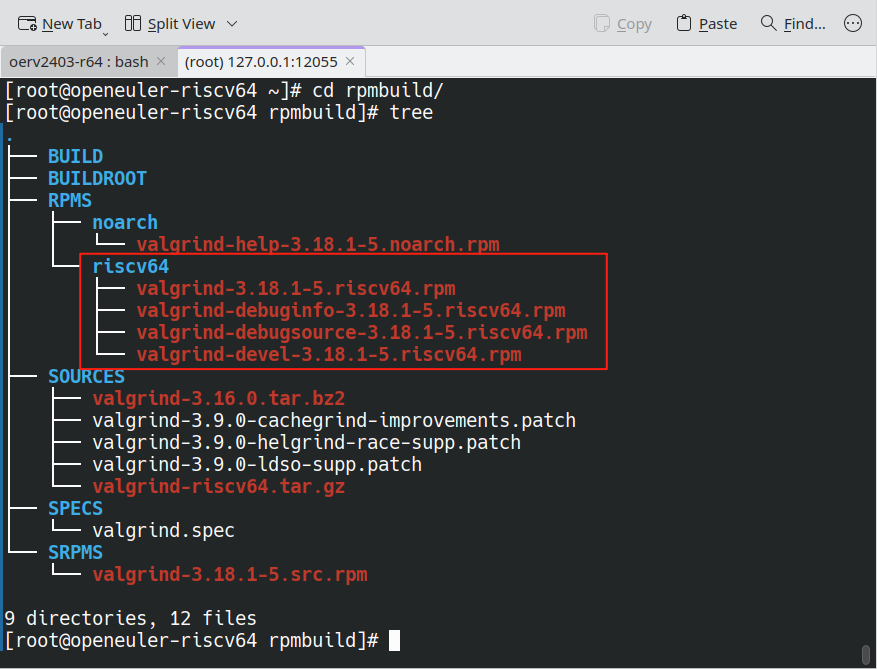
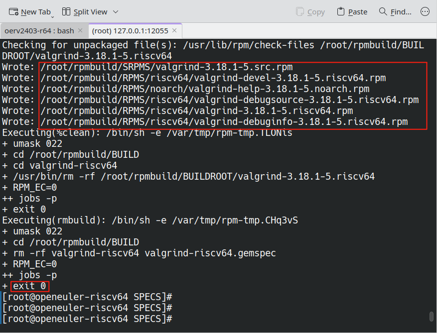
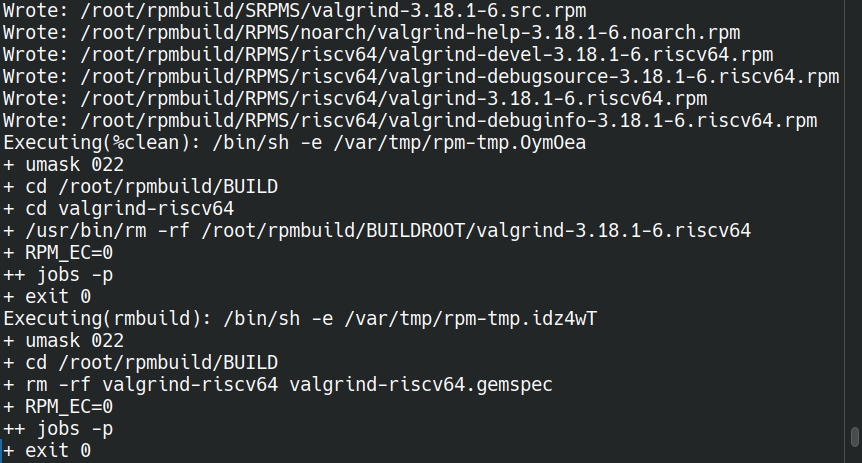

obs会报错,本地可以构建,推测是软件库的问题

```
[  130s] + ./autogen.sh
[  130s] running: aclocal
[  130s] ./autogen.sh: line 6: aclocal: command not found
[  130s] error: while running 'aclocal'
[  130s] error: Bad exit status from /var/tmp/rpm-tmp.XphYYn (%build)
[  130s] 
[  130s] RPM build errors:
[  130s]     Bad exit status from /var/tmp/rpm-tmp.XphYYn (%build)
[  130s] 
[  130s] openeuler-riscv64 failed "build valgrind.spec" at Tue Dec  3 01:35:22 UTC 2024.
[  130s] 
```





可以成功构建修改的软件库:

> https://build.tarsier-infra.isrc.ac.cn/projects/home:EnfangCui:CTyunOS/meta

```
  <repository name="standard_riscv64" rebuild="local" block="never" linkedbuild="off">
    <path project="Factory:RISC-V:Repo" repository="bootstrap"/>
    <path project="openEuler:selfbuild:repo" repository="2302"/>
    <path project="openEuler:selfbuild:repo" repository="2302_epol"/>
       <arch>riscv64</arch>
  </repository>
```


# 2024.12.24开始执行测试

在oerv2403上安装与测试,步骤如下:

> https://github.com/copilot/c/210ce01d-dede-4e68-85a8-7f2f87bb79af

结果如下:

```
== 735 tests, 275 stderr failures, 57 stdout failures, 10 stderrB failures, 13 stdoutB failures, 3 post failures ==
gdbserver_tests/hgtls                    (stdoutB) # 官方显示此错误
gdbserver_tests/mcblocklistsearch        (stderrB)
gdbserver_tests/mcbreak                  (stdout)
gdbserver_tests/mcbreak                  (stdoutB)
gdbserver_tests/mcbreak                  (stderrB)
gdbserver_tests/mcclean_after_fork       (stderr)
gdbserver_tests/mcclean_after_fork       (stdoutB)
gdbserver_tests/mcclean_after_fork       (stderrB)
gdbserver_tests/mchelp                   (stdoutB)
gdbserver_tests/mchelp                   (stderrB)
gdbserver_tests/mcinfcallRU              (stderr)
gdbserver_tests/mcinfcallWSRU            (stderr)
gdbserver_tests/mcinfcallWSRU            (stderrB)
gdbserver_tests/mcinvokeRU               (stdoutB)
gdbserver_tests/mcinvokeRU               (stderrB)
gdbserver_tests/mcinvokeWS               (stdoutB)
gdbserver_tests/mcinvokeWS               (stderrB)
gdbserver_tests/mcleak                   (stderr)
gdbserver_tests/mcleak                   (stdoutB)
gdbserver_tests/mcleak                   (stderrB)
gdbserver_tests/mcmain_pic               (stdout)
gdbserver_tests/mcmain_pic               (stderr)
gdbserver_tests/mcmain_pic               (stdoutB)
gdbserver_tests/mcmain_pic               (stderrB)
gdbserver_tests/mcsignopass              (stderr)
gdbserver_tests/mcsignopass              (stdoutB)
gdbserver_tests/mcsigpass                (stderr)
gdbserver_tests/mcsigpass                (stdoutB)
gdbserver_tests/mcvabits                 (stdoutB)
gdbserver_tests/mcvabits                 (stderrB)
gdbserver_tests/mcwatchpoints            (stderr)
gdbserver_tests/mcwatchpoints            (stdoutB)
gdbserver_tests/nlcontrolc               (stdoutB)
memcheck/tests/accounting                (stderr)
memcheck/tests/addressable               (stdout)
memcheck/tests/addressable               (stderr)
memcheck/tests/atomic_incs               (stdout)
memcheck/tests/atomic_incs               (stderr)
memcheck/tests/badaddrvalue              (stdout)
memcheck/tests/badaddrvalue              (stderr)
memcheck/tests/badfree-2trace            (stderr)
memcheck/tests/badfree                   (stderr)
memcheck/tests/badfree3                  (stderr)
memcheck/tests/badjump                   (stderr)
memcheck/tests/badjump2                  (stderr)
memcheck/tests/badloop                   (stderr)
memcheck/tests/badpoll                   (stderr)
memcheck/tests/badrw                     (stderr)
memcheck/tests/big_blocks_freed_list     (stderr)
memcheck/tests/big_debuginfo_symbol      (stderr)
memcheck/tests/brk2                      (stderr)
memcheck/tests/buflen_check              (stderr)
memcheck/tests/bug155125                 (stderr)
memcheck/tests/bug287260                 (stderr)
memcheck/tests/bug340392                 (stderr)
memcheck/tests/bug401284                 (stdout)
memcheck/tests/bug401284                 (stderr)
memcheck/tests/bug464969_d_demangle      (stdout)
memcheck/tests/bug464969_d_demangle      (stderr)
memcheck/tests/bug472219                 (stderr)
memcheck/tests/bug484002                 (stdout)
memcheck/tests/bug484002                 (stderr)
memcheck/tests/calloc-overflow           (stderr)
memcheck/tests/cdebug_zlib               (stderr)
memcheck/tests/cdebug_zlib_gnu           (stderr)
memcheck/tests/client-msg-as-xml         (stderr)
memcheck/tests/client-msg                (stderr)
memcheck/tests/clientperm                (stdout)
memcheck/tests/clientperm                (stderr)
memcheck/tests/clireq_nofill             (stdout)
memcheck/tests/clireq_nofill             (stderr)
memcheck/tests/clo_redzone_128           (stderr)
memcheck/tests/clo_redzone_default       (stderr)
memcheck/tests/close_range               (stderr)
memcheck/tests/cond_ld                   (stderr)
memcheck/tests/cond_st                   (stderr)
memcheck/tests/custom-overlap            (stderr)
memcheck/tests/custom_alloc              (stderr)
memcheck/tests/cxx17_aligned_new         (stderr)
memcheck/tests/deep-backtrace            (stderr)
memcheck/tests/demangle-rust             (stderr)
memcheck/tests/demangle                  (stderr)
memcheck/tests/descr_belowsp             (stderr)
memcheck/tests/describe-block            (stderr)
memcheck/tests/doublefree                (stderr)
memcheck/tests/dw4                       (stderr)
memcheck/tests/err_disable1              (stderr)
memcheck/tests/err_disable2              (stderr)
memcheck/tests/err_disable3              (stderr)
memcheck/tests/err_disable4              (stderr)
memcheck/tests/err_disable_arange1       (stderr)
memcheck/tests/erringfds                 (stdout)
memcheck/tests/erringfds                 (stderr)
memcheck/tests/error_counts              (stderr)
memcheck/tests/errs1                     (stderr)
memcheck/tests/execve1                   (stderr)
memcheck/tests/execve2                   (stderr)
memcheck/tests/exit_on_first_error       (stderr)
memcheck/tests/exit_on_first_error_with_xml (stderr)
memcheck/tests/exitprog                  (stderr)
memcheck/tests/file_locking              (stderr)
memcheck/tests/fprw                      (stderr)
memcheck/tests/fwrite                    (stderr)
memcheck/tests/gone_abrt_xml             (stderr)
memcheck/tests/holey_buffer_too_small    (stderr)
memcheck/tests/inits                     (stderr)
memcheck/tests/inline                    (stdout)
memcheck/tests/inline                    (stderr)
memcheck/tests/inlinfo                   (stderr)
memcheck/tests/inlinfosupp               (stderr)
memcheck/tests/inlinfosuppobj            (stderr)
memcheck/tests/inltemplate               (stderr)
memcheck/tests/leak-0                    (stderr)
memcheck/tests/leak-autofreepool-0       (stderr)
memcheck/tests/leak-autofreepool-1       (stderr)
memcheck/tests/leak-autofreepool-2       (stderr)
memcheck/tests/leak-autofreepool-4       (stderr)
memcheck/tests/leak-autofreepool-5       (stderr)
memcheck/tests/leak-autofreepool-6       (stderr)
memcheck/tests/leak-cases-exit-on-definite (stderr)
memcheck/tests/leak-cases-full           (stderr)
memcheck/tests/leak-cases-possible       (stderr)
memcheck/tests/leak-cases-summary        (stderr)
memcheck/tests/leak-cycle                (stderr)
memcheck/tests/leak-delta                (stderr)
memcheck/tests/leak-pool-0               (stderr)
memcheck/tests/leak-pool-1               (stderr)
memcheck/tests/leak-pool-2               (stderr)
memcheck/tests/leak-pool-3               (stderr)
memcheck/tests/leak-pool-4               (stderr)
memcheck/tests/leak-pool-5               (stderr)
memcheck/tests/leak-segv-jmp             (stderr)
memcheck/tests/leak-tree                 (stderr)
memcheck/tests/leak_cpp_interior         (stderr)
memcheck/tests/linux/aligned_alloc       (stderr)
memcheck/tests/linux/brk                 (stderr)
memcheck/tests/linux/capget              (stderr)
memcheck/tests/linux/dlclose_leak-no-keep (stderr)
memcheck/tests/linux/dlclose_leak        (stderr)
memcheck/tests/linux/enomem              (stdout)
memcheck/tests/linux/enomem              (stderr)
memcheck/tests/linux/getregset           (stdout)
memcheck/tests/linux/getregset           (stderr)
memcheck/tests/linux/ioctl-tiocsig       (stderr)
memcheck/tests/linux/lsframe1            (stderr)
memcheck/tests/linux/lsframe2            (stderr)
memcheck/tests/linux/memalign            (stderr)
memcheck/tests/linux/memfd_create        (stderr)
memcheck/tests/linux/sigqueue            (stderr)
memcheck/tests/linux/stack_changes       (stdout)
memcheck/tests/linux/stack_changes       (stderr)
memcheck/tests/linux/stack_switch        (stderr)
memcheck/tests/linux/strlcat_strlcpy     (stderr)
memcheck/tests/linux/sys-copy_file_range (stderr)
memcheck/tests/linux/sys-execveat        (stdout)
memcheck/tests/linux/sys-execveat        (stderr)
memcheck/tests/linux/sys-openat          (stderr)
memcheck/tests/linux/sys-preadv2_pwritev2 (stderr)
memcheck/tests/linux/sys-preadv_pwritev  (stderr)
memcheck/tests/linux/sys-statx           (stderr)
memcheck/tests/linux/syscalls-2007       (stderr)
memcheck/tests/linux/syslog-syscall      (stderr)
memcheck/tests/linux/timerfd-syscall     (stderr)
memcheck/tests/linux/with-space          (stdout)
memcheck/tests/linux/with-space          (stderr)
memcheck/tests/lks                       (stderr)
memcheck/tests/long-supps                (stderr)
memcheck/tests/long_namespace_xml        (stdout)
memcheck/tests/long_namespace_xml        (stderr)
memcheck/tests/mallinfo                  (stderr)
memcheck/tests/malloc1                   (stderr)
memcheck/tests/malloc1_ks_alloc          (stderr)
memcheck/tests/malloc1_ks_alloc_and_free (stderr)
memcheck/tests/malloc1_ks_free           (stderr)
memcheck/tests/malloc1_ks_none           (stderr)
memcheck/tests/malloc2                   (stderr)
memcheck/tests/malloc3                   (stdout)
memcheck/tests/malloc3                   (stderr)
memcheck/tests/malloc_free_fill          (stderr)
memcheck/tests/malloc_usable             (stderr)
memcheck/tests/manuel1                   (stdout)
memcheck/tests/manuel1                   (stderr)
memcheck/tests/manuel2                   (stdout)
memcheck/tests/manuel2                   (stderr)
memcheck/tests/manuel3                   (stderr)
memcheck/tests/match-overrun             (stderr)
memcheck/tests/memalign_args             (stderr)
memcheck/tests/memalign_test             (stderr)
memcheck/tests/memccpy1                  (stdout)
memcheck/tests/memccpy1                  (stderr)
memcheck/tests/memccpy2                  (stderr)
memcheck/tests/memcmptest                (stdout)
memcheck/tests/memcmptest                (stderr)
memcheck/tests/memmem                    (stderr)
memcheck/tests/mempool                   (stderr)
memcheck/tests/mempool2                  (stderr)
memcheck/tests/metadata                  (stdout)
memcheck/tests/metadata                  (stderr)
memcheck/tests/mismatches                (stderr)
memcheck/tests/mismatches_xml            (stderr)
memcheck/tests/mmaptest                  (stderr)
memcheck/tests/nanoleak2                 (stderr)
memcheck/tests/nanoleak_dynsupp          (stderr)
memcheck/tests/nanoleak_supp             (stderr)
memcheck/tests/new_aligned_delete_default (stderr)
memcheck/tests/new_delete_mismatch_size  (stderr)
memcheck/tests/new_delete_mismatch_size_supp (stderr)
memcheck/tests/new_nothrow               (stderr)
memcheck/tests/new_override              (stdout)
memcheck/tests/new_override              (stderr)
memcheck/tests/noisy_child               (stderr)
memcheck/tests/null_socket               (stderr)
memcheck/tests/origin1-yes               (stderr)
memcheck/tests/origin2-not-quite         (stderr)
memcheck/tests/origin3-no                (stderr)
memcheck/tests/origin4-many              (stderr)
memcheck/tests/origin5-bz2               (stdout)
memcheck/tests/origin5-bz2               (stderr)
memcheck/tests/origin6-fp                (stderr)
memcheck/tests/overlap                   (stdout)
memcheck/tests/overlap                   (stderr)
memcheck/tests/partial_load_dflt         (stderr)
memcheck/tests/partial_load_ok           (stderr)
memcheck/tests/partiallydefinedeq        (stdout)
memcheck/tests/partiallydefinedeq        (stderr)
memcheck/tests/pdb-realloc               (stderr)
memcheck/tests/pdb-realloc2              (stdout)
memcheck/tests/pdb-realloc2              (stderr)
memcheck/tests/pipe                      (stderr)
memcheck/tests/pointer-trace             (stderr)
memcheck/tests/posix_memalign            (stderr)
memcheck/tests/posix_memalign_supp       (stderr)
memcheck/tests/posix_memalign_xml        (stderr)
memcheck/tests/post-syscall              (stderr)
memcheck/tests/reach_thread_register     (stderr)
memcheck/tests/realloc1                  (stderr)
memcheck/tests/realloc2                  (stderr)
memcheck/tests/realloc3                  (stderr)
memcheck/tests/realloc_size_zero         (stdout)
memcheck/tests/realloc_size_zero         (stderr)
memcheck/tests/realloc_size_zero_again_no (stderr)
memcheck/tests/realloc_size_zero_again_yes (stderr)
memcheck/tests/realloc_size_zero_mismatch (stdout)
memcheck/tests/realloc_size_zero_mismatch (stderr)
memcheck/tests/realloc_size_zero_no      (stdout)
memcheck/tests/realloc_size_zero_no      (stderr)
memcheck/tests/realloc_size_zero_off     (stdout)
memcheck/tests/realloc_size_zero_off     (stderr)
memcheck/tests/realloc_size_zero_supp    (stdout)
memcheck/tests/realloc_size_zero_supp    (stderr)
memcheck/tests/realloc_size_zero_yes     (stdout)
memcheck/tests/realloc_size_zero_yes     (stderr)
memcheck/tests/recursive-merge           (stderr)
memcheck/tests/resvn_stack               (stderr)
memcheck/tests/riscv64-linux/context_float (stdout)
memcheck/tests/riscv64-linux/context_float (stderr)
memcheck/tests/riscv64-linux/context_integer (stdout)
memcheck/tests/riscv64-linux/context_integer (stderr)
memcheck/tests/riscv64-linux/scalar      (stderr)
memcheck/tests/sbfragment                (stdout)
memcheck/tests/sbfragment                (stderr)
memcheck/tests/sem                       (stderr)
memcheck/tests/sendmsg                   (stderr)
memcheck/tests/sh-mem-random             (stdout)
memcheck/tests/sh-mem-random             (stderr)
memcheck/tests/sh-mem                    (stderr)
memcheck/tests/sigaltstack               (stderr)
memcheck/tests/sigkill                   (stderr)
memcheck/tests/signal2                   (stdout)
memcheck/tests/signal2                   (stderr)
memcheck/tests/sigprocmask               (stderr)
memcheck/tests/sized_aligned_new_delete_args (stderr)
memcheck/tests/sized_aligned_new_delete_misaligned1 (stderr)
memcheck/tests/sized_aligned_new_delete_misaligned1_supp (stderr)
memcheck/tests/sized_aligned_new_delete_misaligned1_xml (stderr)
memcheck/tests/sized_aligned_new_delete_misaligned2 (stderr)
memcheck/tests/sized_aligned_new_delete_misaligned2_supp (stderr)
memcheck/tests/sized_aligned_new_delete_misaligned2_xml (stderr)
memcheck/tests/sized_aligned_new_delete_misaligned3 (stderr)
memcheck/tests/sized_aligned_new_delete_misaligned3_supp (stderr)
memcheck/tests/sized_aligned_new_delete_misaligned3_xml (stderr)
memcheck/tests/sized_delete              (stderr)
memcheck/tests/static_malloc             (stderr)
memcheck/tests/stpncpy                   (stderr)
memcheck/tests/str_tester                (stderr)
memcheck/tests/strchr                    (stderr)
memcheck/tests/supp-dir                  (stderr)
memcheck/tests/supp1                     (stderr)
memcheck/tests/supp2                     (stderr)
memcheck/tests/supp_unknown              (stderr)
memcheck/tests/suppfree                  (stderr)
memcheck/tests/suppfreecollision         (stderr)
memcheck/tests/supponlyobj               (stderr)
memcheck/tests/suppsrc_lineno            (stderr)
memcheck/tests/suppsrc_sanlineno         (stderr)
memcheck/tests/suppvarinfo5              (stderr)
memcheck/tests/test-plo-no               (stderr)
memcheck/tests/test-plo-yes              (stderr)
memcheck/tests/thread_alloca             (stderr)
memcheck/tests/threadname                (stderr)
memcheck/tests/threadname_xml            (stderr)
memcheck/tests/trivialleak               (stderr)
memcheck/tests/undef_malloc_args         (stderr)
memcheck/tests/unit_libcbase             (stderr)
memcheck/tests/unit_oset                 (stdout)
memcheck/tests/unit_oset                 (stderr)
memcheck/tests/varinfo1                  (stderr)
memcheck/tests/varinfo2                  (stderr)
memcheck/tests/varinfo3                  (stderr)
memcheck/tests/varinfo4                  (stdout)
memcheck/tests/varinfo4                  (stderr)
memcheck/tests/varinfo5                  (stderr)
memcheck/tests/varinfo6                  (stdout)
memcheck/tests/varinfo6                  (stderr)
memcheck/tests/varinforestrict           (stderr)
memcheck/tests/vbit-test/vbit-test       (stderr)
memcheck/tests/vcpu_bz2                  (stdout)
memcheck/tests/vcpu_bz2                  (stderr)
memcheck/tests/vcpu_fbench               (stdout)
memcheck/tests/vcpu_fbench               (stderr)
memcheck/tests/vcpu_fnfns                (stdout)
memcheck/tests/vcpu_fnfns                (stderr)
memcheck/tests/wcpncpy                   (stderr)
memcheck/tests/wcs                       (stderr)
memcheck/tests/wcsncpy                   (stderr)
memcheck/tests/wmemcmp                   (stderr)
memcheck/tests/wrap1                     (stdout)
memcheck/tests/wrap1                     (stderr)
memcheck/tests/wrap2                     (stdout)
memcheck/tests/wrap2                     (stderr)
memcheck/tests/wrap3                     (stdout)
memcheck/tests/wrap3                     (stderr)
memcheck/tests/wrap4                     (stdout)
memcheck/tests/wrap4                     (stderr)
memcheck/tests/wrap5                     (stdout)
memcheck/tests/wrap5                     (stderr)
memcheck/tests/wrap6                     (stdout)
memcheck/tests/wrap6                     (stderr)
memcheck/tests/wrap7                     (stdout)
memcheck/tests/wrap7                     (stderr)
memcheck/tests/wrap8                     (stdout)
memcheck/tests/wrap8                     (stderr)
memcheck/tests/wrapmalloc                (stdout)
memcheck/tests/wrapmalloc                (stderr)
memcheck/tests/wrapmallocstatic          (stdout)
memcheck/tests/wrapmallocstatic          (stderr)
memcheck/tests/writev1                   (stderr)
memcheck/tests/xml1                      (stdout)
memcheck/tests/xml1                      (stderr)
drd/tests/std_thread2                    (stderr)
drd/tests/unit_bitmap                    (stderr)
drd/tests/unit_vc                        (stderr)
massif/tests/bug469146                   (post)
massif/tests/new-cpp                     (post)
massif/tests/overloaded-new              (post)
none/tests/double_close_range            (stderr) # 官方显示此错误
none/tests/double_close_range_sup        (stderr) # 官方显示此错误
none/tests/double_close_range_xml        (stderr) # 官方显示此错误

...checking makefile consistency
none/tests/Makefile.am:1: error: fdleak_ipv4_xml.stderr.exp-nomain is missing in EXTRA_DIST
none/tests/Makefile.am:1: error: file_dclose_xml.stderr.exp-nomain is missing in EXTRA_DIST
...checking header files and include directives
make: *** [Makefile:1448: regtest] Error 1

```


```
code config.log gdbserver_tests/hgtls.out none/tests/double_close_range.out none/tests/double_close_range_sup.out none/tests/double_close_range_xml.out gdbserver_tests/hgtls.diff none/tests/double_close_range.diff none/tests/double_close_range_sup.diff none/tests/double_close_range_xml.diff
```


纯净环境下进行的测试结果,不知道为什么没有相同的结果

```
xmllint is /usr/bin/xmllint
http://www.oasis-open.org/docbook/xml/4.5/calstblx.dtd:1: parser error : Content error in the external subset
HTTP/1.1 200 OK
^
../docs/xml/tech-docs.xml:23: element include: XInclude error : could not load ../docs/xml/manual-writing-tools.xml, and no fallback was found
../docs/xml/index.xml:6: element book: validity error : Element book content does not follow the DTD, expecting ((title , subtitle? , titleabbrev?)? , bookinfo? , (dedication | toc | lot | glossary | bibliography | preface | chapter | reference | part | article | appendix | index | setindex | colophon)*), got (bookinfo chapter xi:include chapter )
../docs/xml/index.xml:23: element include: validity error : No declaration for element include
../docs/xml/index.xml:23: element include: validity error : No declaration for attribute href of element include
../docs/xml/index.xml:23: element include: validity error : No declaration for attribute parse of element include
../docs/xml/index.xml:23: element include: validity error : No declaration for attribute xmlns:xi of element include
Document ../docs/xml/index.xml does not validate
make[3]: *** [Makefile:703: valid-manual] Error 3
make[2]: *** [Makefile:582: check-am] Error 2
make[1]: *** [Makefile:926: check-recursive] Error 1
make: *** [Makefile:1225: check] Error 
```

再次执行回归测试和非纯净环境下测试的结果相同

```
== 735 tests, 275 stderr failures, 57 stdout failures, 10 stderrB failures, 13 stdoutB failures, 3 post failures ==
```


riscv64纯净环境测试

ls
