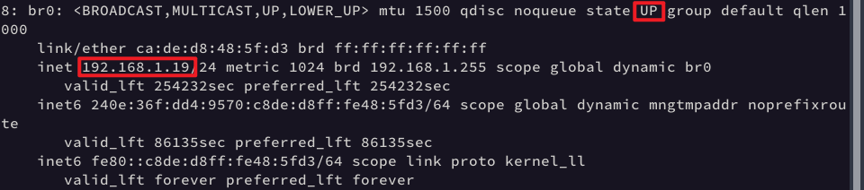

# 重要网址

> 2403 qcow2（r64+x86）地址:  https://repo.openeuler.org/openEuler-24.03-LTS/virtual_machine_img/
>
> obs官网: https://build.tarsier-infra.isrc.ac.cn/
>
> - 参考链接:
>
> - [OBS使用指南](https://tsic.top/post/obs-user-manual/)
> - [如何使用 openEuler OBS - （一）介绍](https://www.openeuler.org/zh/blog/fuchangjie/2020-03-26-how-to-OBS.html)
>
> EulerMaker官网:  https://eulermaker.compass-ci.openeuler.openatom.cn/
>
> - 参考链接：
> - [版本:24.03 LTS SP3](https://docs.openeuler.org/zh/docs/22.03_LTS_SP3/docs/Releasenotes/法律声明.html)[openEuler DevOps](https://docs.openeuler.org/zh/docs/22.03_LTS_SP3/docs/EulerMaker/EulerMaker用户指南.html#)[EulerMaker用户指南](https://docs.openeuler.org/zh/docs/24.03_LTS/docs/EulerMaker/EulerMaker%E7%94%A8%E6%88%B7%E6%8C%87%E5%8D%97.html)
> - [EulerMaker & Yocto & Open Build Service](https://blog.csdn.net/qq_38880380/article/details/139427332)
> - [A Hands-on Demo of EulerMaker EulerMaker 的实践演示](https://www.google.com/search?sca_esv=159f37a1251190f9&tbm=vid&sxsrf=ADLYWIJ41rugsw-5z4s4t6wJ3TcKRneXHQ:1728376526961&q=eulermaker&sa=X&ved=2ahUKEwjjzbWnsP6IAxW3HkQIHdFzCvsQ8ccDegQIDhAH&biw=1920&bih=925&dpr=1#fpstate=ive&vld=cid:6b3b3711,vid:D9KVgkzBiWs,st:0)


# mugen 安装

> https://gitee.com/openeuler/mugen

```bash
# 通用
git clone https://gitee.com/openeuler/mugen.git
bash dep_install.sh

# 特定
bash mugen.sh -c --ip $ip --password $passwd --user $user --port $port
bash mugen.sh -f testsuite -r testcase -x
# 示例
bash mugen.sh -c --ip 10.0.2.15 --password 5959 --user root --port 22
bash mugen.sh -c --ip 192.168.84.136 --password 5959 --user root --port 22
bash mugen.sh -f openscap -r oe_test_scanning_remote_system -x
```

# 修改密码

```bash
passwd
```
# 修改主机名

```bash
sudo hostnamectl set-hostname <newhostname>
```

# ssh连接报错密钥改变

删除旧密钥

```bash
ssh-keygen -R [服务器地址]:[端口] # 端口没有就不写

实例：
ssh-keygen -R [127.0.0.1]:12055
ssh-keygen -R 127.0.0.1:12055
yi
```
重新连接
```bash
ssh -p 12055 root@127.0.0.1
```

# SSH配置Github/Gitee密钥

> https://blog.csdn.net/weixin_42310154/article/details/118340458

# 拉取远程非master分支

```bash
git checkout -b issue-compile-with-openjdk11 origin/issue-compile-with-openjdk11 
```

# Gitee同步上游仓库并提交PR

同步上游仓库的最新内容到本地仓库,以避免在提交PR时出现冲突，以下是具体步骤:

1. 添加上游仓库作为远程仓库:
   首先,在本地仓库中添加原始的上游仓库作为一个新的远程仓库。通常我们将其命名为"upstream"。

```bash
git remote add upstream git@gitee.com:openeuler/mugen.git
```

2. 验证新添加的远程仓库:

```bash
git remote -v
```

   应该能看到origin(fork)和upstream(原始仓库)。

3. 从上游仓库获取最新更改:

```bash
git fetch upstream
```

4. 切换到主分支(通常是master或main):

```bash
git checkout master
```

5. 将上游主分支的更改合并到本地主分支:

```bash
git merge upstream/master
```

6. 将更新后的本地主分支推送到远程fork:

```bash
git push -u origin master
```

7. 创建新的特性分支:
   现在本地主分支已经与上游同步,可以创建一个新的分支来进行修改:

```bash
git checkout -b feature-branch-name
```

8. 在新分支上进行修改,提交更改。

9. 将新分支推送到远程fork:

```bash
git push -u origin feature-branch-name
```

10. 在Gitee上从feature-branch-name分支向openeuler/mugen的主分支创建PR。

通过这个流程,可以确保修改是基于上游仓库的最新版本,从而减少合并冲突的可能性。

需要注意的是,如果PR在被接受之前上游仓库又有了新的更改,可能需要重复步骤3-5来再次同步,然后在特性分支上rebase:

```bash
git checkout feature-branch-name
git rebase master
```

之后,可能需要强制推送到远程分支:

```bash
git push -f origin feature-branch-name
```

这样可以确保PR始终基于最新的上游代码。

# Gitee修改PR

**如果还没有多次提交记录***, 需要修改已提交的PR并保持提交记录整洁（文件记录只有一次）

1. 在本地分支上修改代码，修复错误。

2. 使用 `git add` 暂存修改的文件。

3. 不创建新的提交,而是使用以下命令来修改上一次的提交:

```bash
git commit --amend
```

这会打开一个编辑器,可以修改提交信息(如果需要),如果不需要直接`:wq`。

4. 强制推送:

```bash
git push --force-with-lease origin 自己的分支名
```

这样,PR就会自动更新,而且提交历史中只会显示一次提交。

# Gitee修改PR合并多次提交记录

**如果PR中已经存在多次提交记录**, 提示需要squash, 想将所有的提交记录合并为一个单一的提交，并以最后一次提交为准，可以使用 `git rebase` 和 `git reset` 命令来实现。

1. **查看提交记录的数量：** 需要知道有多少次提交，这样才能确定从哪里开始合并。可以使用以下命令查看提交历史：

   ```bash
   git log --oneline
   ```

   这个命令会列出所有的提交记录，每条记录都会有一个哈希值和提交信息。记住最早的那次提交的位置。

2. **交互式 Rebase：** 假设有 10 次提交，可以从第一次提交开始进行 rebase，将它们压缩为一个。执行以下命令：

   ```bash
   git rebase -i HEAD~10
   ```

   这会打开一个交互式编辑器，显示最近 10 次提交（从 HEAD 开始往回数）。

3. **修改 rebase 编辑器内容：** 编辑器会列出每个提交，格式如下：

   ```
   pick a1b2c3d 1st commit
   pick e4f5g6h 2nd commit
   pick i7j8k9l 3rd commit
   pick m1n2o3p 4th commit
   ```

   需要将第一条提交（最早的提交,注意不是最后一次提交）保留为 `pick`，然后将其余所有提交改为 `squash` 或 `s`。比如：

   ```bash
   pick a1b2c3d 1st commit
   s e4f5g6h 2nd commit
   s i7j8k9l 3rd commit
   s m1n2o3p 4th commit
   ```

   > 注意: 可以使用快捷键`:set number`显示行号, `:2,10s/pick/s/g`将第2-23行的`pick`替换成`s`

   这样，所有提交将被合并到第一个 `pick` 的提交里,注意:代码内容还是最后一次提交的版本, 只是时间按照第一个的版本。

4. **保存并退出编辑器：** 保存修改并退出编辑器后，Git 会将所有的提交压缩为一个，并让编辑合并后的提交信息。只保留想要的（一般是最后一次提交的信息）。然后保存并退出。

5. **强制推送到远程仓库（如果需要）：** 如果已经将这些提交推送到了远程仓库，并且想覆盖远程仓库的历史，需要强制推送：

   ```bash
   git push origin master --force
   git push origin  --force
   ```

   **注意：** 强制推送会改变远程仓库的提交历史，其他协作者可能会受到影响，使用时要小心。

# mugen格式规范

```bash
# source "../common/common_lib.sh"
source "$OET_PATH/libs/locallibs/common_lib.sh"

# DNF_REMOVE
# DNF_REMOVE xxx xxx 
DNF_REMOVE "$@"
```

# 多主机通信桥接网络配置

### 环境

- 主机：arch linux

- 有线网络enp2s0（无线网络有的可能不支持，尽量不用）
- 虚拟机：
  - qemu - openeuler-2403-r64
  - vmware17 - openeuler-2403-x86
  - vmware17 - openeuler-2403-x86

### 配置

#### qemu

1. 安装软件包：
   ```bash
   sudo pacman -S qemu bridge-utils dnsmasq
   ```

2. 创建网桥配置文件：

  - 创建 `/etc/systemd/network/br0.netdev` :

    ```bash
    [NetDev]
    Name=br0
    Kind=bridge
    ```


- 创建 /etc/systemd/network/br0.network :

  ```bash
  [Match]
  Name=br0
  [Network]
  DHCP=yes
  ```

- 创建 /etc/systemd/network/eth0.network :

  ```bash
  [Match]
  Name=enp2s0
  [Network]
  Bridge=br0
  ```

    注意：将 enp2s0 替换为实际有线网络接口名称（使用 `ip-a`查看类似名称`）。

3. 允许QEMU使用网桥：
 - 编辑 /etc/qemu/bridge.conf :
   
    ```bash
    allow br0
    ```
4. 重启网络服务：

  ```bash
  sudo systemctl restart systemd-networkd
  ```

  - 使用`ip-a`可以查看地址情况，当` br0 `状态显示打开且有ip地址出现时，说明配置正确

    

5. 启动脚本中配置QEMU以使用网桥：

   ```bash
   -netdev bridge,id=nd0,br=br0 \
   -device virtio-net-pci,netdev=nd0 \
   ```

   - 启动脚本中` cmd `完整脚本如下（脚本中其余位置不变）

     ```
     cmd="qemu-system-riscv64 \
     -nographic -machine virt \
     -smp "$vcpu" -m "$memory"G \
     -bios "$fw" \
     -drive file="$drive",format=qcow2,id=hd0 \
     -object rng-random,filename=/dev/urandom,id=rng0 \
     -device virtio-vga \
     -device virtio-rng-device,rng=rng0 \
     -device virtio-blk-device,drive=hd0 \
     -netdev bridge,id=nd0,br=br0 \
     -device virtio-net-pci,netdev=nd0 \
     -device qemu-xhci -usb -device usb-kbd -device usb-tablet"
     ```

之后启动脚本，登录后查看ip并进行ping测试即可

#### vmware

> 说明：由于vmware需要使用br0，因此vmware桥接网络的配置应该在br0配置正确之后

1. 将所有虚拟机关机（设置在虚拟机关闭状态下才能生效）

2. 打开虚拟机网络编辑器：`Edit` -> `Virtual Network Editor`，选择桥接模式，使用 `br0`节点

   、、、、

3. 对每个虚拟机的网络适配器进行单独设置，注意不要勾选“复制物理网络连接状态”

   

之后开机启动进行测试即可

### 测试

1. 使用`ip a`查看地址并分别`ping bing.com`

   `openeuler-x86`: 192.168.1.21

   `openeuler-xfce-x86`: 192.168.1.22

   `openeuler-r64`: 192.168.1.17

   

   

   

   2.互相ping

   

   

   

以上两个测试说明每个虚拟机都可以互相通信也能分别连接外网，桥接网络设置成功

> 说明：
>
> 1. 主机关机后，`br0`的设置可能失效，需要再次执行`sudo systemctl restart systemd-networkd`进行网络服务重启，之后查看`br0`，当` br0 `状态显示打开且有ip地址出现即可，如果`br0`此时还是没有打开或没有ip地址，等一两分钟再查看一般就好了
> 2. 先开qemu，发现桥接网络可以了再开vmware
> 3. 一定要尽可能使用有线网络，之前使用无线网络尝试了好多天都没有成功
> 4. 每次开启虚拟机后都应重新检查一下虚拟机中的ip地址是否发生变化

# 软件源查看

```bash
/etc/yum.repos.d/openEuler.repo
```

> （2403）x86软件源：https://repo.openeuler.org/openEuler-24.03-LTS/
>
> OS, everything, EPOL, debuginfo, source, update, 

https://repo.openeuler.org/openEuler-24.03-LTS/OS/

https://repo.openeuler.org/openEuler-24.03-LTS/everything/

https://repo.openeuler.org/openEuler-24.03-LTS/EPOL/main/

https://repo.openeuler.org/openEuler-24.03-LTS/debuginfo/

https://repo.openeuler.org/openEuler-24.03-LTS/update/

# spec文件说明

> [快速通过AUR或者OBS构建一个软件包](https://www.bwsl.wang/script/122.html)
>
> [RPM 包初窥=什么是RPM软件包](https://linux.cn/article-11452-1.html)
>
> [RPM 包是如何从源 RPM 制作的](https://linux.cn/article-11527-1-rel.html)
>
> [如何编写 RPM 的 spec 文件](https://linux.cn/article-11538-1.html)
>
> [如何构建 RPM 包](https://linux.cn/article-10164-1-rel.html)
>
> [YUM 和 RPM 包管理器的不同之处](https://linux.cn/article-12170-1-rel.html)

# mugen重要代码解释

## `CHECK_RESULT`

### 函数主体

```bash
function CHECK_RESULT() {
    actual_result=$1 # 第1个参数，实际结果
    expect_result=${2-0} # 第2个参数，默认0，期望结果
    mode=${3-0} # 第3个参数， 默认0，比较模式
    error_log=$4 # 第4个参数。错误日志
    exit_mode=${5-0} # 第5个参数，默认0，退出模式
    if [ -z "$actual_result" ]; then # 如果实际结果为空，记录错误并返回 1
        LOG_ERROR "Missing actual error code."
        return 1
    fi
    if [ $mode -eq 0 ]; then # 如果mode为0（默认），实际结果与期望结果相等时测试通过不报错
        test "$actual_result"x != "$expect_result"x && {
            test -n "$error_log" && LOG_ERROR "$error_log" # 如果提供了 error_log，将其记录为错误，没有则为空
            ((exec_result++)) # 错误数量+1
            LOG_ERROR "${BASH_SOURCE[1]} line ${BASH_LINENO[0]}" # 记录错误发生的文件和行号
	    if [ $exit_mode -eq 1 ]; then # 如果 exit_mode 为 1，则立即退出脚本
                    exit 1;
            fi
        }
    else #  如果mode不为0，实际结果与期望结果不相等时测试通过不报错
        test "$actual_result"x == "$expect_result"x && {
            test -n "$error_log" && LOG_ERROR "$error_log"
            ((exec_result++))
            LOG_ERROR "${BASH_SOURCE[1]} line ${BASH_LINENO[0]}"
	    if [ $exit_mode -eq 1 ]; then
                    exit 1;
            fi
        }
    fi
    return 0
}
# 总结：
# mode=0时，actual_result=expect_result测试通过
# mode!=0时，actual_result!=expect_result测试通过
# 否则说明测试代码有问题，需要修改
```

说明：
- ${2-0}：如果第二个参数未提供，则使用默认值 0。
- "$actual_result"x：在变量后加 x 是为了防止变量为空时导致的语法错误。

### 特殊结构

```bash
test "$actual_result"x != "$expect_result"x && {...}
```

这行代码包含两个主要部分，用 `&&` 连接：
- `test "$actual_result"x != "$expect_result"x`：条件测试
- `{...}`：如果测试为真，要执行的代码块

1. `&&` 操作符：
   在 Bash 中，`&&` 表示"与"操作。它的作用是：如果左边的命令成功执行（返回状态为0），则执行右边的命令。

2. 代码块 `{...}`：
   花括号 `{}` 用于组织多个命令成为一个块。这个块只有在 `test` 命令返回真（0）时才会执行。

### 语句分隔

Bash 使用多种方式来区分和组织代码语句，包括换行、分号、条件操作符（`&&`、`||`）和代码块

   - 换行：最常见的分隔方式。每个新行通常被视为一个新的语句。
   - 分号 `;`：可以用来在同一行上分隔多个命令。
   - `&&` 和 `||`：用于条件执行。
   - 命令块：用 `{}` 或 `()` 包围的多行命令组。

函数中`test "$actual_result"x != "$expect_result"x && {...}`代码的结构：
```bash
test 条件 && {
  命令1
  命令2
  命令3
  if 条件; then
    命令4
  fi
}
```
这里，如果 test 条件为真，则执行花括号内的所有命令。

说明

- 注意 `if` 语句中的分号：`if [ $exit_mode -eq 1 ]; then`，这里分号用于分隔条件和 `then` 关键字，允许它们在同一行。

### 示例分析

```bash
CHECK_RESULT $? 1 0 "disable repo failed"
```

这行代码调用了 CHECK_RESULT 函数，并传入了4个参数。

1. $?
   - 这是第一个参数，对应函数中的 $1 (actual_result)
   - $? 在 Bash 中表示最近执行的命令的退出状态码
   - 这意味着函数将检查前一个命令的执行结果

2. 1
   - 这是第二个参数，对应函数中的 $2 (expect_result)
   - 表示期望的结果是 1

3. 0
   - 这是第三个参数，对应函数中的 $3 (mode)
   - 0 表示使用默认的比较模式（检查 actual_result 是否不等于 expect_result）

4. "disable repo failed"
   - 这是第四个参数，对应函数中的 $4 (error_log)
   - 如果检查失败，这个字符串将被用作错误消息

5. 没有提供第五个参数 (exit_mode)，所以将使用默认值 0

综合分析：
这行代码的目的是检查前一个命令的执行结果。它期望前一个命令的退出状态码是 1。如果不是 1，则会记录错误 "disable repo failed"。

### $?状态码

在 Bash 中，$? 表示最近执行的命令的退出状态码。这些状态码通常遵循一些常见的约定：

1. **0：成功**
   
   - 命令成功执行，没有错误。
   
2. 1-255：失败
   - 非零值通常表示某种错误或异常情况。具体的值可能因命令而异，但通常：

3. 常见的特定值：
   - 1：一般错误
   - 2：Shell 内建命令使用错误
   - 126：命令找到了，但无法执行（权限问题）
   - 127：命令未找到
   - 128：无效的退出参数
   - 128+n：被信号 n 终止
     例如：
     - 130：被 Ctrl+C 终止（128 + 2，SIGINT 信号）
     - 137：被 SIGKILL 信号终止（128 + 9）
   - 255：退出状态码超出范围

4. 自定义退出码：
   - 程序可以自定义 1-255 范围内的退出码，用于表示不同的错误情况。

5. 特殊情况：
   - 在管道中，$? 通常反映最后一个命令的状态。
   
   - 某些 shell 选项（如 set -o pipefail）可能会改变这种行为。

## `grep "^LOW_OS"`

`^` 符号是一个正则表达式的特殊字符，它有特定的含义：

1. `^` 表示行的开始。
2. 在这个上下文中，`^LOW_OS` 意味着 "以 LOW_OS 开头的行"。

## `dnf install -y "$update_pkg_name" | tee`

`tee` 是一个非常有用的命令行工具，它的主要功能是从标准输入读取数据，然后将数据写入到标准输出和一个或多个文件中。

1. 将 `dnf install` 命令的输出同时显示在屏幕上（标准输出）。
2. 将相同的输出保存到名为 `install_log` 的文件中。

## `update_pkg_name=$(grep update install_log | awk '{print $1}')`

1. 在 install_log 文件中搜索包含 "update" 的行。
2. 将 grep 的输出传递给 awk。
3. awk 命令打印每行的第一个字段（列）。在 DNF 输出中，这通常是动作（如 "Updating"）或包名。

# 使用python批量去除文件夹中所有md文件多余图片

> 参考链接: https://blog.csdn.net/HHHBan/article/details/132503724

批量将某个文件夹中所有md文件没有使用的图片移动到另一个文件夹中方便删除, 要求图片所在文件夹与md文件在同级目录中. 文件布局如下: (remove-img.py可以在某个特定路径下,这里方便操作直接放在md的当前目录)

```bash
├── assets
│   ├── image-20241006141554612.png
│   ├── image-20241006143106772.png
│   ├── image-20241006143548952.png
│   ├── ......
├── remove-img.py
├── xxxxxx.md
└── xxxxxx.md
```

完整代码

```bash
import os
import re
import shutil
import logging

# 配置日志
logging.basicConfig(level=logging.INFO)
logger = logging.getLogger(__name__)


def main():
    # 存放Markdown中引用的图片路径
    pictures_in_markdown = set()

    # 获取Markdown文件路径
    path = input("请输入Markdown文件的路径：").strip()
    # 获取图片的相对存储路径
    img_path = input("请输入图片的相对存储路径，例如：img、image、assets：").strip()

    # 遍历指定路径下的所有文件
    for root, _, files in os.walk(path):
        for file in files:
            file_path = os.path.join(root, file)
            # 判断是否为Markdown文件
            if file_path.endswith('.md'):
                with open(file_path, 'r', encoding='utf-8') as md_file:
                    content = md_file.read()
                    # 正则表达式匹配Markdown文件中所有图片的引用
                    pattern = re.compile(r'!\[(.*?)]\((.*?)\)|]*?src="(.*?)"[^>]*?>')
                    matches = pattern.findall(content)
                    for match in matches:
                        ref = match[1] or match[2] or match[3]
                        # 获取图片名称
                        begin_index = ref.find(img_path) + len(img_path) + 1
                        # 将图片路径添加到集合中
                        picture = ref[begin_index:]
                        pictures_in_markdown.add(picture)

    # 获取指定目录中的所有图片
    pictures_in_directory = []
    for root, _, files in os.walk(os.path.join(path, img_path)):
        for file in files:
            pictures_in_directory.append(file)

    # 创建存放多余图片的目录
    redundant_dir = os.path.join(path, "RedundantImg")
    if len(pictures_in_directory) - len(pictures_in_markdown) != 0:
        os.makedirs(redundant_dir, exist_ok=True)

    # 查找多余的图片
    redundant_images = [img_file for img_file in pictures_in_directory if img_file not in pictures_in_markdown]

    # 将多余的图片移动到指定的目录
    for img_file in redundant_images:
        img_path_src = os.path.join(path, img_path, img_file)
        img_path_dst = os.path.join(redundant_dir, img_file)
        logger.info(f"移动冗余图片: {img_file}")
        shutil.move(img_path_src, img_path_dst)

    # 输出结果信息
    logger.info("操作完成，程序结束！")
    logger.info(f"Markdown中引用的图片有 {len(pictures_in_markdown)} 个！")
    logger.info(f"目录中的图片有 {len(pictures_in_directory)} 个！")
    logger.info(f"冗余的图片有 {len(redundant_images)} 个")


if __name__ == "__main__":
    main()
```

运行命令

```bash
[rani@egbk md]$ python remove-img.py 
请输入Markdown文件的路径：./
请输入图片的相对存储路径，例如：img、image、assets：assets
INFO:__main__:移动冗余图片: image-20241009095427668.png
INFO:__main__:移动冗余图片: image-20240829171933754.png
INFO:__main__:操作完成，程序结束！
INFO:__main__:Markdown中引用的图片有 9 个！
INFO:__main__:目录中的图片有 108 个！
INFO:__main__:冗余的图片有 99 个
```

去除移动后的多余图片文件夹

```bash
[rani@egbk md]$ ls
10月.md  assets  RedundantImg  remove-img.py  外部可见产出记录.md  常见问题与处理办法.md
[rani@egbk md]$ rm -rf RedundantImg
[rani@egbk md]$ ls
10月.md  assets  remove-img.py  外部可见产出记录.md  常见问题与处理办法.md
```

